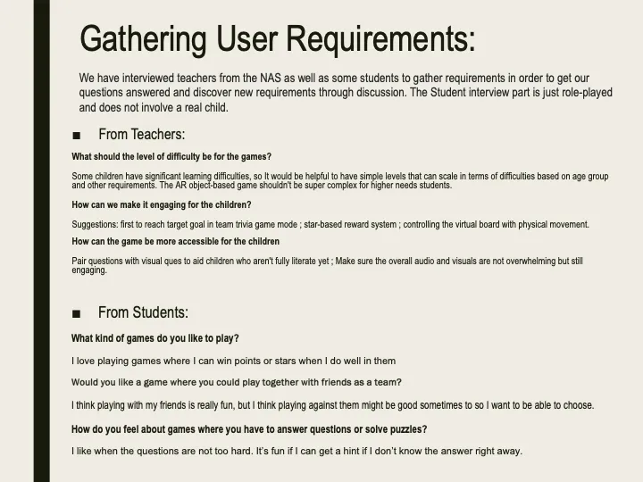
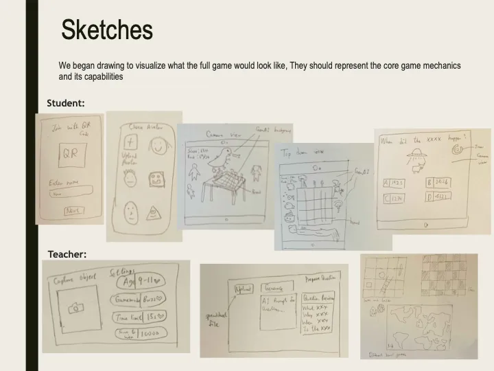
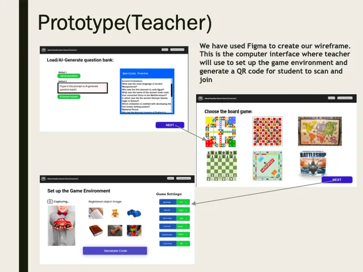
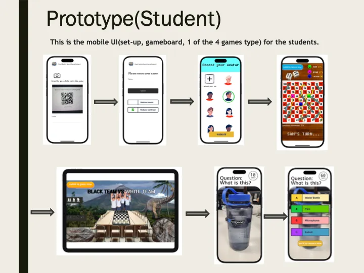
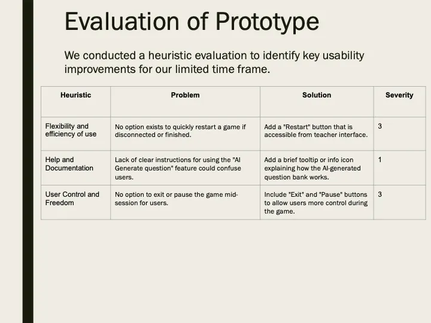
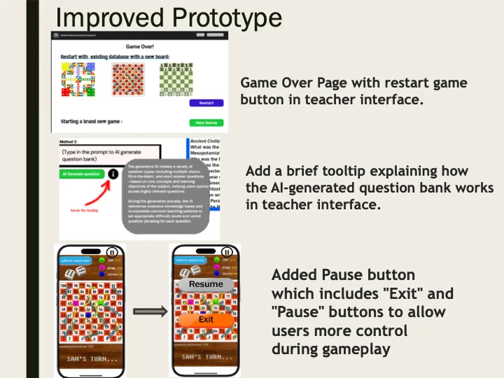

## Section 1 - HCI Presentation
Here is the HCI presentation with our project prototype and heuristics of the design, showing our planning process.

### Section 1.1 - Gathering User Requirements

### Section 1.2 - Sketches

### Section 1.3 - Prototypes

### Section 1.4 - Evaluation of Prototype

### Section 1.5 - Prototype Improvements

