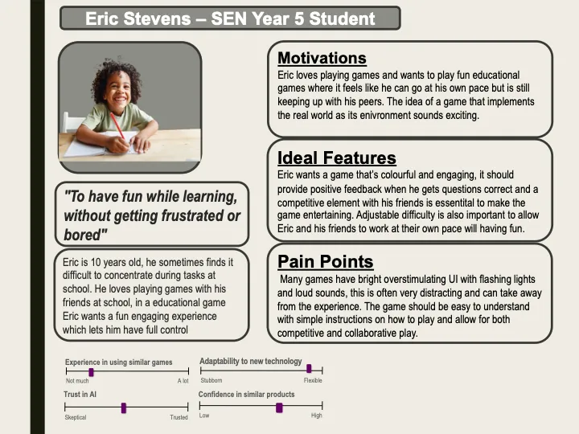

## Section 1 - User Requirements for HCI

Our team is developing **Classroom Explorers**, a quiz engine and board game to help children learn anywhere. We aim to enable Hybrid Learners to interact and Gamify Classroom Experiences using **MotionInput**, **IBM Granite GenAI technology**, and **Unity Game Engine**. This allows children in hospitals to join remotely via video calls and experience learning and interaction in the same way as their peers, ensuring that learning is tailored to student needs and remains accessible to students in need.

We have conducted interviews with various stakeholders to gather requirements and better understand user needs. This includes a teacher from the **National Autistic Society (NAS)** and a role-played student interview due to security reasons.

### Section 1.1 - Teachers from NAS

**Jack Simmon** is a dedicated teacher for primary school students with special educational needs (SEN). His primary goal is to create engaging, educational experiences that are informative, fun, and accessible to all students. He emphasizes that students with **Special Educational Needs and Disabilities (SEND)** benefit greatly from:

#### User Requirements for Teachers:
1. **Interactive & Engaging**: Use quizzes, games, and interactive tools to maintain attention.
2. **Accessible to Lower Literacy Levels**: Provide simplified text and audio options for support.
3. **Tailored Learning**: Content should be customizable for different age groups and learning abilities.
4. **Calming Theme**: Use soft, non-distracting colors and minimalistic design to reduce sensory overload.
5. **Mixed Reality**: Utilize visual incentives like 3D avatars or virtual environments for immersion.
6. **Remote Access**: Ensure seamless video call and remote interaction capabilities for accessibility.

### Section 1.2 - Student with SEND Needs

**Eric Stevens** is a 10-year-old child with **Special Educational Needs and Disabilities (SEND)**, particularly facing challenges with attention and focus during school tasks. However, he loves playing games with his peers, which helps maintain his engagement. He desires a learning experience that feels more like play and offers constant feedback to help guide his learning progress.

#### User Requirements for Eric:
1. **Self-Paced Learning**: Control over learning speed with options to pause, rewind, or slow down.
2. **Peer Interaction**: Competitive or collaborative elements to stay engaged with classmates.
3. **Colourful Visuals**: Bright, appealing graphics that stimulate attention without overwhelming.
4. **Frequent Feedback**: Immediate positive reinforcement to encourage progress.
5. **Game Engagement**: Points, avatars, and rewards to maintain interest.
6. **Clear Instructions**: Simple guidance for easy navigation and understanding.

---

## Section 2 - HCI Presentation

### Section 2.1 - Gathering User Requirements

### Section 2.2 - Sketches

### Section 2.3 - Prototypes

### Section 2.4 - Evaluation of Prototype

### Section 2.5 - Prototype Improvements

