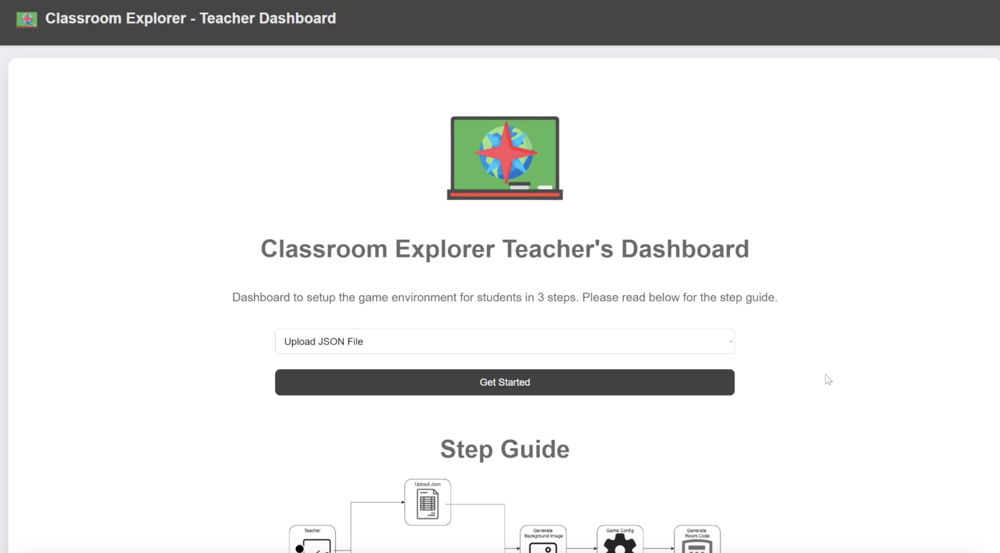

our game serves two types of users: Teacher and Student. Below are the User Manual for both type of users with both video and written guide:

## Teacher User Manual

Here is a short video on how to use the teacher dashboard:
<iframe width="560" height="315" src="https://www.youtube.com/embed/tznzLesVEvk" frameborder="0" allowfullscreen></iframe>

Below is a written step guide on how to navigate through the teaher dashboard:
### 1 - Home page

- On the home page, there is a step guide on how the user can navigate throught the set up process for the game.
- User can select two ways to prepare questions: a) upload json file, b) Using object recognition and GenAI to generate questions, to proceed to next page.

### 2a - Prepare question - upload json file

- User can click the box to upload json file filled with questions to proceed to next page.

### 2b - Prepare question - generate questions

- User will be requested to recognise 6 objects using the webcam to proceed to next quiz question generator
- User will be requested to select the prompts for the question generated by AI, click Generate Quiz Questons to proceed(Generation will take a while, please wait while its processing).

### 3 - Background Image Generation

- User can set the prompts for the AI image generator, then click the button the start generating the image
- click confirm button below the generated image, then click "Go to Next Page" to procced to next page

### 4 - Game Configuration Settings

- User can configure the game settings in the dropdown buttons, then click apply settings to start the game.

---

## Student User Manual

Classroom Explorers is designed to be easy to learn, fun to play, and enjoyable with or without strategic thinking. Most importantly, it’s suited for a learning environment, integrating seamlessly with our AI quiz engine. The game's difficulty level is slightly lower than Monopoly.

Inspired by *Mario Party*, a digital board game designed for a younger audience, Classroom Explorers features simple controls—players only need to press a single button at a time to roll the dice, make decisions, and progress through the game.

The game relies heavily on randomness, particularly through dice rolls, which reduces competitiveness while keeping gameplay fun and unpredictable. Additionally, a **CO-OP mode** allows players to work together rather than compete against each other.

### Showcase Video

<iframe width="560" height="315" src="https://www.youtube.com/embed/Bo3ZEbmgZ4A" frameborder="0" allowfullscreen></iframe>

> **Note:** While the showcase video was recorded on a computer, the game is designed to run on a phone with Augmented Reality. Issues like the UI blocking the board or the board appearing too small won’t be a problem. We are also continuously improving the UI to make the game more intuitive to play.

### How to Play

At the start of the game, all players spawn on their **Home Tile**. Players take turns rolling the dice, determining how many steps they move. Different tiles have unique effects:

- **Blank Tile** – No effect.
- **Gain Points Tile** – Earn a random number of points (increasing over time).
- **Lose Points Tile** – Lose a random number of points (increasing over time).
- **Reroll Tile** – Roll the dice again.
- **Portal Tile** – Teleport to a random portal tile.
- **Trap Tile (Black)** – Take 1-3 damage.
- **Quiz Tile** – Answer multiple-choice questions to earn rewards.
- **Home Tile** – Heal 2 HP and use it as a checkpoint to earn trophies or level up (depending on game mode).

Players can stop at their **own Home Tile** even without rolling the exact number needed to land on it.

Once all players have taken their turn, the next round begins in the same order. At the start of each round, **all players must answer a question** (like Quiz Tiles). This cycle continues until the game ends.

### Game Objective

- **Solo & Team Mode** – Earn points by moving across the board and playing the game. Use points to earn trophies. The game ends when a player collects **5 trophies**. The points required for each trophy increase as more trophies are earned.
- **Co-op Mode** – Work together to defeat the boss by attacking it with dice rolls. The boss walks around the board and targets players. The boss has extra dice and a large HP pool. Players can level up using points to gain buffs that enhance attacks and increase health points.

### Combat System

To make the game feel more dynamic, we’ve introduced a **Combat System**, where players and bosses (in co-op mode) have **Health Points (HP)**.

When a player and another player or the boss cross paths (by passing by or landing on the same tile), they can choose to engage in **combat**. The system is inspired by *Risk*, where battles are decided by dice rolls.

In **Co-op or Team Mode**, players have the option to heal each other instead of initiating a fight.

📌 **We highly recommend watching the showcase video for a clearer understanding of combat mechanics.**

### How Combat Works

1. **Initiating Combat** – The player who starts the combat is the attacker and rolls the dice first to determine their attack value.
2. **Defending** – The opponent (defender) rolls next but must first choose to either:
    - **Block** → Takes damage equal to (Attack - Defense) (minimum 1).
    - **Evade** → Takes no damage if (Defense > Attack), otherwise takes full Attack damage.
3. **Counterattack** – The roles switch, and another round of combat occurs following the same rules.
4. **End of Combat** – After both attack rounds, the battle ends.

### Defeat and Revival

If a player’s **Health Points reach zero**, they lose **half their points** and **revive after four rounds**.

### Quiz Modes

- **Default Mode** – Answer one question within a time limit. Rewards are based on correctness, with bigger rewards for streaks. Incorrect answers result in either no reward or a small reward (50/50 chance). *(Similar to Kahoot)*
- **Buzz Mode** – Similar to Default Mode, but **speed** also affects rewards. Faster answers earn bigger rewards.
- **Time Rush Mode** – Answer as many questions as possible within a time limit. Rewards are based on (correct answers – incorrect answers), scaling from no reward to big rewards.

#### Quiz Rewards

Quiz rewards keep the game dynamic by introducing **buffs** that affect gameplay each round. These buffs include:

- **Double/Triple Dice** – Grants extra dice rolls.
- **Double/Triple Points** – Multiplies points gained from Gain Points tiles.
- **Attack/Defend/Evade Bonus** – Increases combat values (e.g., rolling 5 for attack with a +2 bonus results in 7 attack power).

📌 **Buffs are temporary and can stack with each other.**

