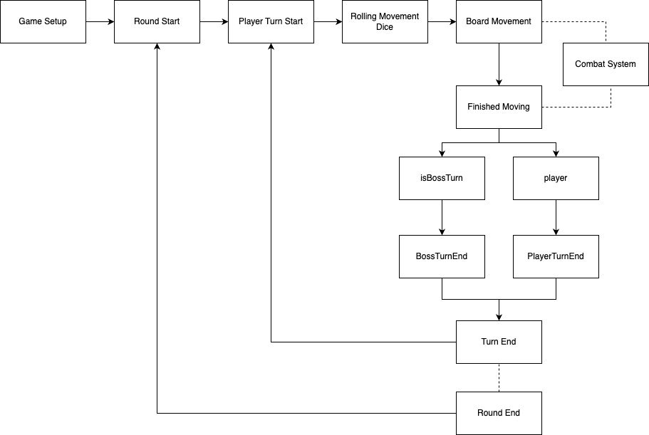

## Overview

Our project aims to reduce the burden of generating lesson materials for teachers as well as create an entertaining environment where students can both learn and enjoy themselves by playing a game with their cohort. The use case of our project and its target audience has been constantly kept in mind during the development process; hence we have made sevral design choices to make our project as accessible and easy to use for our target audience as possible. This is achieved by using quantized AI models, optimized rendering pipelines and a lightweight networking solution.

## Technologies

<details>
<summary>Unity (URP)</summary>

We use Unity's Universal Render Pipeline (URP) to ensure optimal performance on mobile devices while maintaining visual clarity. All assets are low-poly to reduce rendering cost.
</details>

<details>
<summary>Photon PUN 2</summary>

For multiplayer capabilities, Photon's PUN 2 library enables real-time syncing of players over a remote cloud server, we have been selective on which components need further reliability handshakes and delta compression to reduce network overhead as much as possible without impacting the performance of our game too greatly.
</details>

<details>
<summary>IBM Granite 3 8B (Quantized to 4-bit)</summary>

The AI backend uses a lightweight quantized model of IBM's Granite 3-8B Instruct LLM for generating multiple-choice quiz questions tailored to different subjects and age groups the quantized optimization allows for question generation to work on devices with 4GB of VRam.
</details>

<details>
<summary>DreamShaper 8 (Stable Diffusion Model)</summary>

This diffusion model is used to generate themed backgrounds for quizzes. It supports both decorative and minimalistic quiz panel modes.
</details>

<details>
<summary>YOLOv11x (OpenCV)</summary>

Real-time object detection is powered by YOLOv11x. It's used to analyze classroom images and identify objects relevant to quiz generation or interaction.
</details>

<details>
<summary>React + Vite (Dashboard Frontend)</summary>

The teacher-facing dashboard is built with React and bundled using Vite, it provides a user-friendly interface for teachers to set up quizzes.
</details>

## Teacher Dashboard Implementation

### 1.1 IBM Granite Question Generator

The Quiz sequence is an essential component in our game, as mentioned earlier quiz generation happens via our LLM, to allow teachers to set up the game we have created a Teacher Dashboard where there are options to input subject, number of questions, age group and an optional parameter of item for our object recognition feature. These inputs are then used to construct a well-structured prompt for the LLM and that output is parsed and grouped, the teachers can view the questions immediately after generation and can confirm which questions they want in the game.

#### Parameter Collection and Request Initiation

When the teacher configures the quiz using the dashboard form, a GET request is made to the backend API using the specified parameters, this api call is `GET /ai/generate/`.

This API call requests the question set generated by our LLM based on the inputs the teacher has selected.

#### Prompt Construction 

Once the request is received, a prompt is built based on the teacher's input, bellow is an accurate pseudocode representation of how this prompt set up is done in our project:

#### Prompt Building Psuedocode
```psuedo
FUNCTION get_prompt(number, subject, ageGroup, item=None):

    SET base_prompt TO a string:
        "Generate {number} multiple choice quiz questions "
        "with 4 choices based on {subject}, suitable for children at {ageGroup} years old. "
        "Ensure there is only 1 correct answer and include the correct answer. "
        "Do not include any quotation marks in the output. "
        "Output each question in the following format:"
        "Question:\n"
        "ChoiceA:\n"
        "ChoiceB:\n"
        "ChoiceC:\n"
        "ChoiceD:\n"
        "Answer:\n"
        "Here is an example of output:\n"
        "Question:What is the only planet that hosts life that we know of?\n"
        "ChoiceA:Earth\n"
        "ChoiceB:Mars\n"
        "ChoiceC:Jupiter\n"
        "ChoiceD:Venus\n"
        "Answer:A"

    IF item IS NOT NULL:
        REPLACE the phrase 
            "Generate {number} multiple choice quiz questions"
        WITH 
            "Generate {number} multiple choice quiz questions around {item}"
        IN base_prompt

    RETURN base_prompt
```

This prompt building allows us to receive a consistent format of answers from the LLM, it also allows us to not only generate question sets by simply subject and age group but also by using the object recognition feature. As you can see in the pseudocode, when there is an item provided, the prompt rescopes to form questions around said item.

#### Generating Questions

To generate questions, we call the prompt builder function we have just described, parse the generated prompt and pass it into the LLM. We then need to process and clean the output of the LLM, this is used to display the question sets in the teacher UI and the game quiz sequence. 

#### Generate Questions Pseudocode
```psuedo
FUNCTION generateQuestions(number, subject, ageGroup, item=None):

CALL get_prompt(number, subject, ageGroup, item) AND STORE result in prompt

SEND chat TO the LLM using create_chat_completion
    SET max_tokens TO (number * 200 + 200)
    SET temperature TO 0.85
    STORE the result in response

EXTRACT output text from response['choices'][0]['message']['content']

SPLIT output text into a list of lines using splitlines()
STRIP whitespace from each line AND REMOVE empty lines
STORE result in textList

INITIALIZE empty list called questions

FOR index FROM 0 TO length of textList, IN STEPS OF 6:
    EXTRACT question FROM textList[index] AFTER the colon
    EXTRACT choiceA FROM textList[index + 1] AFTER the colon
    EXTRACT choiceB FROM textList[index + 2] AFTER the colon
    EXTRACT choiceC FROM textList[index + 3] AFTER the colon
    EXTRACT choiceD FROM textList[index + 4] AFTER the colon
    EXTRACT answer  FROM textList[index + 5] AFTER the colon

    CREATE a new QuizQuestion with the above values
    ADD the QuizQuestion to questions list

RETURN questions
```

The pseudocode above illustrates how this is achieved in our implementation. Specifically, we extract the relevant content from Granite’s output, then split the response into individual lines. These lines are filtered to retain only those that contain questions, answer options, or correct answers. Since our prompt enforces a consistent and sequential format, we are able to group these elements accordingly to construct structured quiz questions. Each quiz question is generated as follows:

#### QuizQuestion Class Psuedocode
```psuedo
Class QuizQuestion:
    Method __init__(question, choiceA, choiceB, choiceC, choiceD, answer):
        Set the object's question to the given question
        Set the object's choiceA to the given choiceA
        Set the object's choiceB to the given choiceB
        Set the object's choiceC to the given choiceC
        Set the object's choiceD to the given choiceD
        Set the object's answer to the given answer

    Method to_string():
        Return a string formatted as:
            "Question: [question]"
            "ChoiceA: [choiceA]"
            "ChoiceB: [choiceB]"
            "ChoiceC: [choiceC]"
            "ChoiceD: [choiceD]"
            "Answer: [answer]"
```

#### Confirming and Displaying Questions in the Dashboard

Once the questions are generated and parsed, they are displayed in the Teacher Dashboard interface for review. The teacher can view each question along with its multiple-choice options and correct answer. At this stage, the teacher has the option to confirm the generated questions before they are used in the game.

When the teacher confirms the selected questions, a POST request is sent to the backend via the following API route:

`POST /config/confirm-questions/`
This route receives the final list of questions chosen by the teacher and stores them in the backend configuration.

To retrieve and display the confirmed questions in the Teacher Dashboard or in-game logic, we use:

`GET /config/get-questions/`
This endpoint fetches the saved list of questions from the backend, ensuring that both the frontend dashboard and the Unity game client can access a consistent set of confirmed quiz data.

### 1.2 Object Recognition

As mentioned earlier, our system incorporates an object recognition feature that allows teachers to hold up an object, and the backend uses a YOLOv11x model to identify the objects in the image. These detected objects can then be used to guide the quiz generation process, as outlined in the prompt construction section.

Object recognition is triggered via the following route:

`POST /recognize/`
This endpoint receives an uploaded image and analyzes it using the YOLOv11x object detection model.

After receiving the request, the backend runs inference using the YOLOv11x model. The image is passed into the model, which returns a list of bounding boxes, class labels, and confidence scores. The highest confidence results are then sorted and returned to the front end.

This process is shown in the pseudocode snippet below, which outlines how the detection class loads the model, performs inference, extracts object labels and scores, and returns the final sorted list of recognized items:

#### Object Detection Pseudocode
```pseudo
CLASS Detection:

    FUNCTION __init__():
        GET current file's directory path AND STORE in path
        CONCATENATE path with relative YOLO model path
        LOAD YOLO model from this path AND STORE in self.model

    FUNCTION detect(image) RETURNS list:
        RUN the model on the given image AND STORE results in results
        INITIALIZE empty list called detection_results

        FOR each result IN results:
            GET bounding boxes from result.boxes

            FOR i FROM 0 TO number of boxes:
                GET box AT index i
                GET label name FROM result.names USING box class index
                GET confidence score FROM box

                ADD dictionary {
                    "label": label,
                    "score": score as float
                } TO detection_results

        SORT detection_results by score in descending order

        RETURN detection_results

    FUNCTION cpu():
        MOVE self.model to CPU
```

These labels are then optionally used during prompt generation to produce questions specific to the recognized item, enabling question sets with the recognised object. 

### 1.3 Background Generation

Our system also generates background images using the stable diffusion model Dreamshaper 8, this is used for the background image of the quiz panel and the game board panel, these backgrounds correlate to the theme of the question sets for the game. 

For background generation we have two API Routes:

`GET /generate-background-image/`

`GET /generate-quiz-background-image/` 

The prompts passed to the model are generated using helper functions based on the subject and age group selected by the teacher. The logic is illustrated below:

#### Genrating Game Background Pseudocode
``` pseudo
DEFINE get_background_prompt(subject, ageGroup):
    DEFINE subject_prompts as DICTIONARY of subject → descriptive background prompt string using ageGroup

    IF subject exists in subject_prompts:
        RETURN subject_prompts[subject]
    ELSE:
        RETURN default general educational background prompt using subject name and ageGroup
```
#### Generating Quiz Background Pseudocode
DEFINE get_quiz_panel_background_prompt(subject, ageGroup):
    DEFINE quiz_panel_prompts as DICTIONARY of subject → quiz-specific background prompt string using ageGroup

    IF subject exists in quiz_panel_prompts:
        RETURN quiz_panel_prompts[subject]
    ELSE:
        RETURN default general quiz-friendly background prompt using subject name and ageGroup

This pseudocode shows how the prompt is selected. If a predefined subject prompt exists, it is used; otherwise, a general fallback prompt is constructed. This approach ensures that we always return a prompt compatible with our diffusion model, even for subjects not explicitly defined.

Once generated, the backgrounds are displayed on the Teacher Dashboard for review. The teacher can then confirm their preferred images, which are uploaded to the backend using `POST /confirm-background/` for decorative backgrounds and `POST /confirm-quiz-background/` for quiz panel backgrounds, ensuring they are available for use in the final game environment.

### 1.4 React + Vite Website
We developed a React-based website for the teacher dashboard using React components. The frontend communicates with the Python backend server through api.js, which handles fetching and sending data via API requests.
For navigation, we used react-router-dom to create browser routes, allowing users to navigate seamlessly between different pages.
The website is styled using CSS to ensure a clean and user-friendly interface. We utilize modular CSS and CSS-in-JS techniques (such as styled-components or inline styles where needed) to maintain consistency and improve maintainability.

```
import { BrowserRouter as Router, Routes, Route } from "react-router-dom";

function App() {
   return (
       <Router>
           <Header />
           <Routes>
               <Route path="/" element={<HomePage />} />
               <Route path="/upload-json" element={<UploadQuizQuestionPage />} />
               <Route path="/upload-image" element={<UploadImagePage />} />
               <Route path="/generate-questions" element={<GenerateQuestionPage />} />
               <Route path="/room-code" element={<RoomCodePage />} />
               <Route path="/background-image" element={<SetBackgroundImage />} />
               <Route path="/teams" element={<TeamsPage />} />
               <Route path="/settings" element={<SettingsPage />} />
           </Routes>
           <Footer />
       </Router>
   );
}

export default App;
```

## Game Implementation
### 3.1 Game Configurations

Our game contains a GameConfigManager that is responsible for retrieving the configuration settings that the teacher has chosen in the Teacher Dashboard. These settings are fetched automatically from a backend API when the game starts and are used to configure the core game rules and parameters for the session.

The implementation for this is shown below: 

#### Game Configuration Manger Psuedocode
```pseudo
On Awake:
    If no instance exists:
        Set as singleton
        Make persistent across scenes
        Initialize rules for each GameMode
    Else:
        Destroy duplicate instance

On Start:
    Start coroutine to fetch config from API

FetchConfigData():
    Send GET request to backend
    If error occurs:
        Log warning
        Use backups for game settings
        Set IsFetchComplete to true
    Else:
        Parse JSON into config object
        Apply config settings

ApplyConfigData(config):
    Set quiz time limit
    Set game mode
    Set number of players
    Set quiz mode
    Set board number
    Mark fetch as complete

GetCurrentRules():
    Return rule set for current game mode
``` 

As shown above the key configuration settigs: Quiz Time Limit, Number of Players, Quiz Mode, Board Number are retrieved, these are used for set up and gameplay rules, if there is some error with the fetching or any parameters aren't select we have put into place appropriate backups to ensure the game continues regardless. 

### 3.2 Core entity classes

Our game contains two types of entities, Players and Boss. The player entity is what each student controls, boss is an environment entity that the player competes against . Both entities inherit from the Entity Class, a concise pseudo code version of this can be seen below: 

#### Core Entity Class
```pseudo
class Entity ()
    property Health
    property Status

    FUNCTION LoseHealth(amount)
    FUNCTION Dies()
    FUNCTION TeleportTo(position, tile)

    FUNCTION AddBuff(type, value, duration)
    FUNCTION UpdateBuffDurations()
```

As you can see from the above, the entity class defines some important base stats such as health and status, status refers to wether an entity is alive or not, as the game progresses players battle the boss entity and these core stats are essential to the logic for this, the methods `LoseHealth` and ` Dies` is how we implement changes in the health and status. 

The pseudocode also illustrates the set up for the buff system, throughout the game players can recieve buffs that provide some sort of advantage, below we will go into further depth about the types of buffs. The Entity method `UpdateBuffDuration` and `AddBuffs` are used to add buffs and manage how long they last. 

#### Buff Types

Our game contains several types of buffs, these can be permanent and last throughout the game or temporary and finish after the given buff duration. This is a comprehensive list of all the buff types: 
- AttackUp - this causes a damage increase for the combat system 
- DefenseUp - this causes a deffense increase for the combat system
- EvadeUp - this gives a higher evade value for the combat system
- ExtraDice - allows to roll more than one dice
- DoublePoints - doubles point gains
- TriplePoints - tripple point gains

The Double Points and Triple Points buff are not used by the boss entity and only on the players, these are also not stackable and only the largest buff to the given player will be used. 

#### Player Class and Boss Class

As we have discussed alerady player and boss both inherit the Entity class, however they both also have individual stats and behaviour that is not shared between the two, below is a summary of the key individual components. 

<details>
<summary>Player</summary>

Contains unique properties and functionality including:
- Player Identification:
  - Unique playerID
  - Points, Level tracking
  - Trophy and Quiz Streak counters

- Health System:
  - Revival counter
  - Maximum health settings
  - Health management methods (damage, healing, revival)

- Buff Management:
  - PlayerBuffs container (extends EntityBuffs)
  - Special buff handling (DoublePoints, etc.)

- Core Functions:
  - Awake & Update: Initializes state and UI elements
  - UI Initialization: Updates based on game mode (COOP/FFA)
  - Points & Trophy Management: Handles leveling, buffs, rewards
  - Teleportation: Board position management with height offsets

- State Management:
  - Turn indicators (directional cone)
  - Death state handling
  - Level progression logic
</details>

<details>
<summary>Boss</summary>

Contains unique properties and functionality including:
- Core Structure:
  - Singleton pattern implementation
  - Dynamic MAX_HEALTH scaling
  - Entity class inheritance

- Health System:
  - Health scaling based on player count
  - Death condition triggers game win
  - Health UI synchronization

- Buff Management:
  - BossBuffs container (extends EntityBuffs)
  - Restricted buff application logic
  - Boss-specific buff validation

- Core Functions:
  - Initialization: Sets up health and initial state
  - Damage Handling: Updates health and UI
  - Teleportation: Board position management
  - Test Buff Application: Development testing

- State Management:
  - Death state handling
  - Win condition triggering
  - Position tracking
</details>


### 3.3 Pre-game character selection 

The flow diagram above describes the overall game flow for our project, we will discuss this flow in more detail in later section of this report, however we have also included a pregame stage for additional customisation of player avatars. 
This Character selection stage allows for customisation of the color of the player avatar and what hat the player avatar wears, this is stored and is later accessed by our player manager to initialise player avatars with the correct presets. 

#### Character Selection 

```pseudo
Start:
    Get all body color options under player
    Get all hat options under player
    Turn all off
    Turn on first body color and hat

NextBodyColor / PreviousBodyColor:
    Turn off current body color
    Change index (forward/backward, wrap around)
    Turn on new body color

NextHat / PreviousHat:
    Turn off current hat
    Change index (forward/backward, wrap around)
    Turn on new hat

StartGame:
    Save selected body color and hat
    Load game scene
```

The simplified pseudocode above illustrates the core logic behind this selection

### 3.4 Manager Overview



The flow diagram above illustrates the core game flow for our project, this is flow is controlled by `GameManager` which utilises several other submanagers that control the flow of key aspects of the game such, the `GameManager` manages states in a centralised way, below is an illustration the different states in `GameManager` and the flow from each state .

``` psuedo
On Start:
    Change state to GameSetup

Method ChangeState(newState):
    Update currentState
    Call OnStateChanged(newState)
    Notify listeners of state change

Method OnStateChanged(newState):
    Switch based on newState:
        - GameSetup → SetupGame()
        - RoundStart → Start Round Coroutine
        - PlayerTurnStart → Start Player Turn
        - RollingMovementDice → Enable dice (boss auto-roll, player clicks)
        - BoardMovement → Start movement unless resuming
        - PlayerCombat → Set flag to resume movement after
        - FinishedMoving → Trigger tile actions
        - PlayerTurnEnd → Move to next player
        - BossTurn → Start boss turn
        - BossTurnEnd → Reset boss turn, go to next round
        - GameEnd → End the game
```
As mentioned our game contains several sub managers along with the GameManager that is the central authority on state flow. Below is a high level view of all the managers in the game and their respective tasks:

<details>
<summary>PlayerManager</summary>

- Handles player initialization and spawning
- Manages player appearances and customization
- Controls turn progression between players
- Updates player stats and UI elements
- Handles trophy and level progression
</details>

<details>
<summary>BossManager</summary>

- Controls boss spawning and initialization
- Manages boss positioning on the board
- Handles boss movement and combat triggers
- Updates boss health and state
</details>

<details>
<summary>UIManager</summary>

- Manages all in-game UI elements
- Handles prompts and notifications
- Updates player stats displays
- Controls button interactions and animations
</details>

<details>
<summary>CameraManager</summary>

- Controls camera positioning and movement
- Manages zoom levels and transitions
- Handles combat view transitions
- Positions dice for rolling
</details>

<details>
<summary>CombatManager</summary>

- Orchestrates combat sequences
- Manages attack and defense phases
- Calculates damage and applies effects
- Controls combat animations and transitions
</details>

<details>
<summary>RoundManager</summary>

- Tracks game rounds and turns
- Handles round-based point allocation
- Manages player revival system
- Updates buff durations
</details>

<details>
<summary>TileManager</summary>

- Manages board tile interactions
- Controls path highlighting
- Handles special tile effects
- Manages tile connections and navigation
</details>

<details>
<summary>QuizManager</summary>

- Loads and manages quiz questions
- Controls quiz flow and timing
- Evaluates player performance
- Handles reward distribution
</details>

<details>
<summary>DiceManager</summary>

- Controls dice rolling mechanics
- Manages multiple dice instances
- Calculates roll results
- Handles physics-based dice simulation
</details>

### 3.5 Game Setup

At the start of our game after character selection we load up `ARBoard Scene` and enter the state `GameSetup` when this state starts in game manager the method. This method essentially calls our game initialiser which checks if all core components are initialised. 

``` pseudo
FUNCTION ConfirmManagerReady(managerName):
    SWITCH managerName:
        CASE "UIManager":
            Set isUIManagerReady to true
        CASE "PlayerManager":
            Set isPlayerManagerReady to true
        CASE "TileManager":
            Set isTileManagerReady to true
        CASE "RoundManager":
            Set isRoundManagerReady to true
        CASE "QuizManager":
            Set isQuizManagerReady to true

    Call CheckAllComponents()
``` 


The above shows a simplified version of our swtich case to illustrate which managers are checked at game setup, they only enter this swtich case when the manager object is loaded and the intialisation steps for each indiivdual manager is complete.

### 3.6 Player and Boss Initalisation

As mentioned in section 3.1 our game contains two entities, boss and player, initalisation for the player happens through player manager, the snippet below is a simplified view into how this happens: 

``` psuedo
FUNCTION Start():
    WAIT until GameConfigManager has fetched data
    WAIT until TileManager is ready

    CALL InitialisePlayers()
    CALL SpawnAllPlayersAtHome()

    FOR each player in players:
        CALL avatarGenerator.GenerateAvatar(player)

    CALL SpawnAllHomesAtHome()
    
    NOTIFY GameInitializer that PlayerManager is ready
```

As you can see tile manager needs to be initialise before player initalisation and tile spawn, this because players spawn in at home tiles and tiles keep track of wether there is a player on them, so it is essential to allow for players to spawn. 

Spawn for boss happens in a similar fashion but instead of spawning at home tiles, boss spawns in relation to a given distance between players. 

```
FUNCTION SpawnBossAtStartTile():

    WAIT until TileManager is ready
    WAIT until PlayerManager is ready

    GET list of all tiles from TileManager
    GET list of all players from PlayerManager

    INITIALIZE:
        bestTile ← null
        maxMinDistance ← -1

    FOR each candidate tile in allTiles:
        SET minDistanceToPlayer ← infinity

        FOR each player:
            GET player's current tile
            IF player tile is valid:
                CALCULATE distance between candidate tile and player tile
                UPDATE minDistanceToPlayer ← minimum of current value and this distance

        IF minDistanceToPlayer > maxMinDistance:
            SET maxMinDistance ← minDistanceToPlayer
            SET bestTile ← candidate tile

    IF bestTile found:
        SET spawnTile ← bestTile
    ELSE:
        SET spawnTile ← first tile in the list

    SET spawnTile.BossOnTile ← true
    CALCULATE spawn position (apply vertical offset for floating above tile)

    MOVE boss to spawn position
    SET boss’s current tile reference to spawnTile
```
### 3.7 Board Generation

The game board is generated at runtime based on a JSON layout file. This layout defines the structure, tile types, connections, and decorative arrows, allowing for flexible board configurations and makes creating maps easier, below we will go over how we have implemented this in our code base. 

#### Game Board Generation Pseudocode
``` pseudo
Start:
    Wait until config is loaded
    Load board layout JSON (fallback if missing)

Generate Tiles:
    For each tile in JSON:
        Instantiate tile prefab at correct position
        Set tile type and apply corresponding material
        If home player ID exists, assign it

Generate Arrows:
    For each arrow in JSON:
        Instantiate arrow prefab with correct rotation

Set Tile Connections:
    For each tile:
        For each direction in its connection list:
            Link to neighboring tile in that direction

Mark board as ready
```
As shown in the code above, at startup, the system loads a JSON file named according to the board number from GameConfigManager (we have explained the responsibilities of this manager in section 3.1). If the specific layout is missing, there is a fallback to a default layout. The JSON data includes a list `TileData[] tiles` (which contains the connected tiles, coordinates, and an optional homePlayerID to indicate that the tile is a home tile) and an arrows list `ArrowData[] arrows`, which contains the coordinates and rotation of decorative direction arrows that are used to signifying that there is a crossroads. Tile prefabs are then instantiated after loading the JSON, with their appropriate materials and coordinates. Decorative direction arrows are placed above the instantiated tiles, and the connections between adjacent tiles are set up, this is later used in player movement to indicate valid direction choices. After generation is complete, a global flag BoardGenFinished is activated so the game can proceed.

### 3.8 Quiz 

#### Loading Quiz 

As mentioned in section 1.1 our project utilises IBM's Granite model for question generation, the stored question sets are retrieved via the method `Preload Questions`,this is a method in the `QuizManager`, how this loading of questions works is shown below: 

```psuedo
FUNCTION PreloadQuestions():
    CALL DownloadQuestionsJSON()

    SET availableQuestions = copy of loaded questions
    SET usedQuestions to empty
    SET questionsLoaded = true
```
as you can see when the method is called we initialise a list of questions from the downloaded JSON, we also initialise an usedQuestions list to empty, this is where we will move questions that have been used to avoid reusing the questions players have already answered . 

#### Starting a New Quiz

When the quiz sequence is triggered (this happens either through a quiz tile or the start of a new round) we call the `StartNewQuiz` function in our `QuizManager` Class. The logic behind this function is shown below : 

``` pseudo
FUNCTION StartNewQuiz(isRoundQuiz):
    IF quiz is already transitioning or active:
        RETURN

    SET OnQuizComplete = false
    SET isRoundQuiz flag
    DISABLE Board UI
    START Coroutine QuizSequence()
```
As shown in the pseudocode above, StartNewQuiz first checks to see if the quiz is transitioning or active. If it is not, then it sets OnQuizComplete to false, checks to see if this is a quiz event triggered by the start of the round. If it is, that means all players must play the quiz and hence the flag is set and finally it turns off the Board UI and starts the Quiz Sequence. This is necessary as in our game the quiz is not another scene but instead a panel that slides up and down, hence UI elements would clutter the quiz panel.

#### Main Quiz Logic 
After the quiz panel slides up, the main logic for the quiz begins. This logic is handled by the QuizManager and consists of selecting the appropriate number of questions, displaying them one by one, tracking correct answers and time taken, and finally distributing rewards based on performance.

The number of questions selected depends on the quiz mode (Normal, Buzz, or Time Rush). Questions are randomly selected from a preloaded list and removed from the pool after being used to avoid repetition. The player's response and streak are tracked, and the UI is updated in real time using the QuizDisplay component.

The logic for this is shown below:

```
FUNCTION QuizSequence():
    CALL StartQuizSequence()
    CALL StartQuizLogic()

    WHILE quiz is active:
        IF timeRemaining <= 0 OR all questions answered:
            SET quiz as inactive
            BREAK

    CALL EndQuizSequence()
    CALL HandleQuizComplete()
```

##### StartQuizLogic Pseudocode
```
FUNCTION StartQuizLogic():
    SET timer to quizDuration
    SET currentQuestionIndex = -1
    SET quiz as active
    ENABLE answer buttons

    SET mode = current quiz mode
    SET questionCount = 5 IF mode is TIME_RUSH ELSE 1

    IF not enough questions in pool:
        RESET question pool

    SELECT random subset of questionCount from available pool
    REMOVE selected questions from available pool
    STORE them as currentQuizQuestions

    CALL DisplayNextQuestion()
```

Answer Evaluation Logic Pseudocode:
```
FUNCTION CheckAnswer(selectedIndex):
    IF quiz not active:
        RETURN false

    GET correct answer for current question
    INCREMENT answeredQuestionsCount
    CALCULATE lastAnswerTime = now - questionStartTime

    IF answer is correct:
        INCREMENT correctAnswerCount
        INCREMENT player’s quiz streak
    ELSE:
        RESET player’s quiz streak

    RETURN true IF correct ELSE false
```

##### Quiz Completion and Reward Pseudocode
```
FUNCTION HandleQuizComplete():
    DETERMINE rewardTier = EvaluateQuizPerformance()

    IF isRoundQuiz:
        FOR each player:
            GIVE rewardTier
    ELSE:
        GIVE rewardTier to current player

    SET OnQuizComplete = true
```

##### EvaluateQuizPerformance Pseudocode
```
FUNCTION EvaluateQuizPerformance():
    SWITCH (current quiz mode):
        CASE NORMAL:
            RETURN EvaluateDefaultMode()
        CASE BUZZ:
            RETURN EvaluateBuzzMode()
        CASE TIME_RUSH:
            RETURN EvaluateTimeRushMode()
```

Each of these evaluation methods takes into account the player's performance (score, speed, or streaks) to return a tiered reward:
- NoReward

- SmallReward

- MediumReward

- BigReward


### 3.9 Tiles

As mentioned in section 3.6 our game board is made up of several connected tiles. Appart from storing references to connections and possible directions from a tile, tiles also contain other characteristics such as tileType and tilePlayerID. Our game consists of 7 different tile types that cause a player to do a specific action as well as one normal tile type with no action. 

#### Tile Types

##### Home Tile

When a player lands on their designated home tile, they are given the option to end their movement early, even if they have remaining steps. The tile serves two main purposes, depending on the selected game mode:

 - Cooperative Mode: If the player has enough points, they can level up, which increases their player level, player levels gives players a permanent    buff and an increase in health, this helps players fight the boss to win the game
 - Team / Free-For-All Mode: If the player has enough points and hasn't yet reached the maximum trophy count, they can earn a trophy. Trophies contribute toward individual progression and victory conditions.

Each home tile is uniquely assigned to a player at the beginning of the game. Visually, a flag with the player's color is placed on their home tile. Level ups and trophy gains also increase the current milestone, the milestone system adds a multiplier to point gains and hence a shared milestone system prevents one player from advancing much faster than others in the game. 


##### Gain Points

When a players final move is a Gain Points tile they gain a certain number of points, the ammount of points they gain depends on several factors: the current milestone, any buffs they may have and base point value. The below pseudocode shows how this gain points allocation works: 
``` psuedo
FUNCTION HandleGainPointsTile(player):

    SET milestone ← PlayerManager.CurrentMilestone
    SET milestoneMultiplier ← 1.0 + 0.5 * (milestone - 1)

    SET basePoints ← RANDOM_INT_IN_RANGE(1, 5)
    SET finalBasePoints ← ROUND_TO_INT(basePoints * milestoneMultiplier)

    SET buffMultiplier ← 1
    IF player.HasTriplePointsBuff():
        SET buffMultiplier ← 3
    ELSE IF player.HasDoublePointsBuff():
        SET buffMultiplier ← 2

    SET totalPoints ← finalBasePoints * buffMultiplier

    IF buffMultiplier > 1:
        UIManager.DisplayBonusMultiplier(buffMultiplier)

    CALL UIManager.DisplayPointChange(finalBasePoints)  
    CALL UIManager.DisplayGainStarAnimation(player.ID)

    CALL player.AddPoints(totalPoints)
  ```

As you can see above base point value is calculated by a random number between 1-5 inclusive, this value is then multiplied with the current milestone multiplier and any buffs the player may have. Buffs are not stacked and only the highest buff is choosen. Then after the calcuation there is an animation for gaining points and the point value is added to the relevant player. 

##### Lose Points

The lose points tile acts simmilarly to gain points but has the adverse effect, players who land on this tile as their final move are punished
by having a point deduction. The calculation for this deduciton is shown below:

```pseudo
FUNCTION HandleLosePointsTile(player):

    SET milestone ← PlayerManager.CurrentMilestone
    SET dropMultiplier ← 1.0 + 0.5 * (milestone - 1)

    SET basePointsLost ← RANDOM_INT_IN_RANGE(1, 5)   
    SET finalPointsLost ← -ROUND_TO_INT(basePointsLost * dropMultiplier)

    CALL UIManager.DisplayPointChange(finalPointsLost)
    CALL UIManager.DisplayLoseStarAnimation()

    CALL player.AddPoints(finalPointsLost)  
```

As you can see the point deduction is effected by two values, base points and a drop mutliplyer. Base points is again choosen by a random number generator with the range 1-5. The drop multiplier takes into account the current milestone of players and substracts points accordingly. This means that while progressing through milestones does cause faster point increases it also causes more aggresive point deductions. After the calculation is complete an animation for drop point plays and the player's points are substracted. 


##### Trap

The trap tile is another tile that punishes players that land on it as their final step, trap tile causes a health deduction for the given player. This works with the health system where if a player's health reaches zero they die and are unable to play the game for a specified ammount of rounds. The calculation for how much health is deducted again is random, trap tiles however do not get more or less powerful acording to milestones and hence it is simply a random number within a range of 1-2 that is deducted. After this the health is dedcuted from the apropriate player and an anvil dropping animation plays.

##### Quiz

This tile initates a quiz sequence with one of the quiz questions we have generated with our Granite model and retrieved from our teacher dashboard, this process is explained in section 1.1. Only the player who has landed on the quiz tile is allowed to play the quiz, after answering the quiz sequence the player gets rewarded based of the quiz system, this has been explained in section 3.8. 

##### Portal 

This is a unique tile type where the player teleports to the position of any other random tile type. 

``` pseudo
ClASS TileManager: 
CASE Portal Tile:
    TILE destinationTile = GetRandomPortalTile(tile)
    if destinationTile  NOT null: 
        currentPlayer.TeleportTo(destinationTile)
        currentTile.TilePlayerIDS.remove(player)
        destinationTile.TilePlayerIDS.add(player)

FUNCTION GetRandomPortalTile(tile):
LIST availableTiles = portalTiles.remove(tile)
if availableTiles < 0:
RETURN NULL
length = length(availableTiles)
RETURN random index in range(length)
``` 
as you can see from the above pseudocode on the case of a portal tile we first get a randomly assigned portal tile via the method GetRandomPortalTile, this method works by getting a list of all portal tiles, making a new list of tiles without the tile that the player is currently on, then returning a random tile from that list. 

##### Reroll tile

This tile awards the player who lands on it with a second dice roll before their turn completes, how this is implemented is shown below: 

```pseudo
CLASS TileManager: 
CASE Re-roll Tile :
    GameManger.HandleReroll()

CLASS GameManger: 
FUNCTION HandleReroll():
    CALL ChangeState WITH argument GameState.RollingMovementDice
END FUNCTION
```

as you can see above the reroll tile case causes the Game manager to switch the state back to rolling movement dice by passing the switching of the next player causing the current player to get an extra turn. 

#### Player tile id system

We also keep track of which players are on tiles, this is essential for the combat and healing mechanics aswell as how the boss finds players and spawns in. This is done by each tile storing a list `TilePlayerIDs`, whenever a player lands on a certain tile, its unique player ID is added into that tiles list, it is subsequently also removed whenever the player moves of this tile. This done by doing `tile.TilePlayerIDs.remove(player)` and `tile.TilePlayerIDs.add(player)` which simply inserts or delets an ID from the list.   

### 3.10 Movement
Player movement is a core mechanic in the game. At the start of their turn, players roll a set of dice to determine how many steps they can move across the board. This mechanic is orchestrated by the DiceManager and Dice classes and tightly with the board, animation, and prompt systems.

#### Dice Rolling Logic
When the player's turn begins, the DiceManager enables the roll button. The number of dice is calculated based on player buffs (e.g., ExtraDiceBonus). Once the player rolls:

Old dice are cleared and new ones are instantiated.Each dice object (Dice) is thrown with physics-based forces and torque. Dice monitor their stability until they land and determine the result.
#### `Role Dice Logic` 
```pseudo
FUNCTION EnableDiceRoll(isBoss):
    IF isBoss:
        SET numDice = 1 + boss bonus
    ELSE:
        SET numDice = 1 + player bonus
    SHOW roll dice button

FUNCTION RollDice():
    CLEAR old dice
    INSTANTIATE numDice new dice
    FOR each dice:
        ADD force and torque based on world scale
        SUBSCRIBE to OnDiceFinishedRolling

FUNCTION HandleDiceFinishedRolling():
    Decrement remainingDice
    IF all dice rolled:
        RETURN total sum to GameManager
```
The Dice class handles individual dice physics. It detects when a dice becomes stable or times out after 5 seconds and determines the face pointing upward as the result.

#### Movement Execution
Once the dice roll is complete, the result is passed to the PlayerMovement class, which moves the player across tiles step by step. Each step decrements the remaining movement count.
#### `MovePlayer` 
```psuedo 
FUNCTION MovePlayer(steps):
    WHILE steps > 0:
        IF crossroads:
            PROMPT player for direction
        MOVE to next tile
        steps -= 1
        WAIT for animation
```

We have a hop movement animation for each tile and camera tracking ensures the player stays in view. Prompts are presented via PromptManager, and player decisions are passed back using callbacks.

As well as this Player Movement can be stopped early in three cases, as mentioned in section 3.11 and 3.9 players can choose to terminate their movement early if they either land on a home tile, or encounter another entity.

On the case where a player has encountered another entity they can choose to stop for either combat or healing. Players can initate comabt with other players if this has been specifed in the game configuration settings, otherwise they can choose to heal fellow players. The logic for these encounters looks like this: 

``` pseudo
IF NOT initialMove:
    IF PvP is allowed:
        PROMPT player to fight other player(s) on same tile
        IF player agrees:
            TRIGGER combat
            STOP movement
            IF player died:
                isMoving = false
                EXIT coroutine

    ELSE IF Healing is allowed:
        PROMPT player to heal other player(s) on same tile
        IF player agrees:
            HEAL target player
            STOP movement
```

As you can see in the pseudocode above players can choose to stop at a tile to heal or fight another player depending on the configuration settings of the game. PVP is only allowed when the player is not doing its inital move. 

For a boss encounter the logic is simmilar to the player PVP, instead of combat with another player however it is with the main boss in game. The logic for this is illusrated below:
```
    IF Boss exists on tile:
        PROMPT player to fight boss
        IF player agrees:
            TRIGGER boss combat
            STOP movement
            IF player died:
                isMoving = false
                EXIT coroutine
```

As you can see the the logic remains simmilar, however this encounter also checks to see if a player has died during the combat as this means they will remain inactive for the following rounds till respawn. 


Boss Movement happens in a simmilar fashion however as no one plays as the boss, the dice are automatically rolled, all direction choices are made optimally so the boss will always move towards the closest player, this works with a Breadth First Search algorithim, how this is implemented is shown below:

#### `GetDirectionTowardsPlayers` \

``` psuedo
FUNCTION GetDirectionTowardsPlayers(startTile, availableDirections):
    nextTile, currentTile = null, startTile
    initialDirections is empty dictionary
    queue is empty queue 
    visited is empty set

    FOR each direction IN availableDirections:
        SET nextTile TO startTile.GetConnectedTile(direction)
        IF nextTile is not null:
            ADD nextTile TO queue
            SET initialDirections[nextTile] TO direction

    WHILE queue is not empty:
        SET currentTile TO queue.Dequeue()

        IF currentTile in visited:
            CONTINUE

        ADD currentTile TO visited

        IF currentTile has players:
            RETURN initialDirections[currentTile]

        FOR each direction IN currentTile.GetAvailableDirections():
            nextTile = currentTile.GetConnectedTile(direction)
            IF nextTile is not null AND nextTile not in visited:
                ADD nextTile TO queue
                IF nextTile not in initialDirections:
                    SET initialDirections[nextTile] TO initialDirections[currentTile]

    RETURN random direction from availableDirections
    ```

As show above, the algorithim maintains an intial dictionary of directions, and maps each explored tile to its corresponding inital direction, if a player is found after moving down this direction the intial direction is returned. We make use of a queue for this traversal, this ensures that the algorithim checks all tile directions a step at a time naturally choosing the closest option. If no player is found the boss does not have an optimal choice to make and hence a fall back of any random valid direction is choosen.

### 3.11 Combat

As mentioned in earlier sections, our game implements a combat system between entities. All entities have a given health and damage value; damage can be increased for players through buffs. For combat, two entities roll dice to get either an attack or defend score.

The combat system is managed by the `CombatManager`. When a combat encounter is triggered, we call `HandleFight`, which temporarily teleports the entities and camera to a combat scene, runs the combat logic, and then restores everything back to its original position.

#### Combat flow
The overall flow for combat is handled in the method HandleFight and can be described by the following pseudocode:

```
FUNCTION HandleFight(entityA, entityB):
    RECORD original positions and rotations
    TELEPORT entities and camera to combat area
    CALL CombatSequence(entityA, entityB)
    TELEPORT entities and camera back to original positions
```

#### CombatSequence Logic
 - Combat proceeds in two turns (one for each entity). In each turn:

 - One entity attacks (rolls for attack)

 - The other defends or evades (rolls accordingly)

 - Damage is calculated and applied

 - Death is checked

The core logic is shown below:
```psuedo
FUNCTION CombatSequence(entityA, entityB):
    FOR each turn (0 and 1):
        SET attacker and defender

        PROMPT attacker to roll attack dice
        PROMPT defender to defend or evade

        IF evading:
            ROLL evade value
            IF evade > attack:
                NO damage
            ELSE:
                APPLY full damage
        ELSE:
            ROLL defence value
            CALCULATE damage = max(1, attack - defence)
            APPLY damage to defender

        IF any entity dies:
            END combat
            BREAK
```

Each attack and defence roll includes a bonus, which is fetched via GetBonus() and is determined based on buffs and whether the entity is attacking, defending, or evading. 

#### Damage Resolution

After the roll results are obtained, damage is resolved in the ApplyDamage method. The logic for this is:

```pseudo
FUNCTION ApplyDamage(target, isEvade, attackValue, defenceValue, evadeValue):
    IF isEvade:
        IF evadeValue > attackValue:
            damage = 0
        ELSE:
            damage = attackValue
    ELSE:
        damage = max(1, attackValue - defenceValue)

    REDUCE target's health by damage
    DISPLAY damage on screen
```
This system ensures that every attack always deals at least 1 damage unless the player successfully evades.

#### Boss vs Player

A few key differences between boss and player entites in combat: 
- Boss can never evade
- Players can choose to evade or defend
- Like movement Boss' dice roll is automatic however player must click the dice roll prompt

#### 3.12 AR
Our game includes an Augmented Reality (AR) feature that allows mobile players to place the board into the physical environment using a mobile device. This system is implemented using Unity’s AR Foundation package and is activated at the beginning of the game in the ARBoard scene.

AR functionality centres around surface detection and board placement. Players use a touchscreen interface to place the virtual game board on a flat surface detected in the real world. Once the board is placed, AR detection is disabled and the game proceeds with the board fixed in position.

The logic behind this system is shown below:

```
FUNCTION Awake():
    IF running on PC:
        SET world scale to 1
        SHOW board immediately
    ELSE:
        SET world scale to 0.05
        HIDE board until placed

FUNCTION FingerDown(finger):
    IF board has already been placed OR finger is not primary:
        RETURN

    PERFORM raycast from screen position to detect planes

    IF plane is hit:
        SET board position to hit point
        SET board scale using world scale

        IF plane is horizontal:
            ROTATE board to face camera

        ACTIVATE board
        CALL GameInitializer.InitializeGame()
        DISABLE all planes and plane detection
```
As shown above, raycasting is used to detect valid surfaces for board placement. When a horizontal plane is tapped, the board is positioned at the hit point and rotated to face the player. Plane detection is disabled afterwards to lock the board in place and avoid visual clutter. This system ensures that the game board appears realistically anchored in the physical world.

### 3.13 Game Modes

Our Game Contains 4 different Game modes: Buzz, FFA, COOP, Time Rush. Each mode alters how the game is played, how milestones work and how players interact with each other. 

#### COOP

In COOP players work together to defeat the boss, in this game mode players can heal each other on encounters and win the game when the boss is dead.

#### FFA 
In the Free For All mode players change milestones based on a trophy system, if they have gained enough points and are at a home they will level up 

#### Time Rush
In time rush there are consecutive questions that must be done under a stricter time limit, incentivising faster answers. 

#### Buzz

Buzz follows a standard buzz layout for a game whre players must buzz in to answer questions, this also encourages more competitive play among players. 


## Multiplayer Implementation 

As mentioned in earlier sections, our game implements a combat system between entities. All entities have a given health and damage value; damage can be increased for players through buffs. For combat, two entities roll dice to get either an attack or defend score.

The combat system is managed by the CombatManager. When a combat encounter is triggered, we call HandleFight, which temporarily teleports the entities and camera to a combat scene, runs the combat logic, and then restores everything back to its original position.