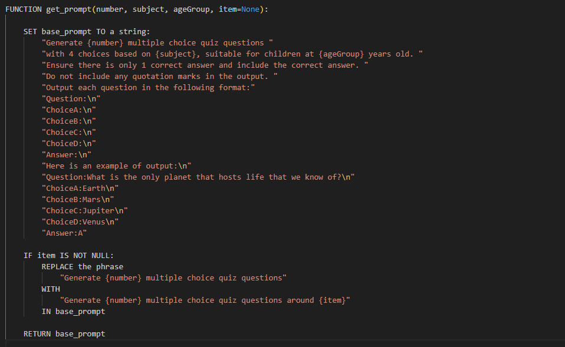
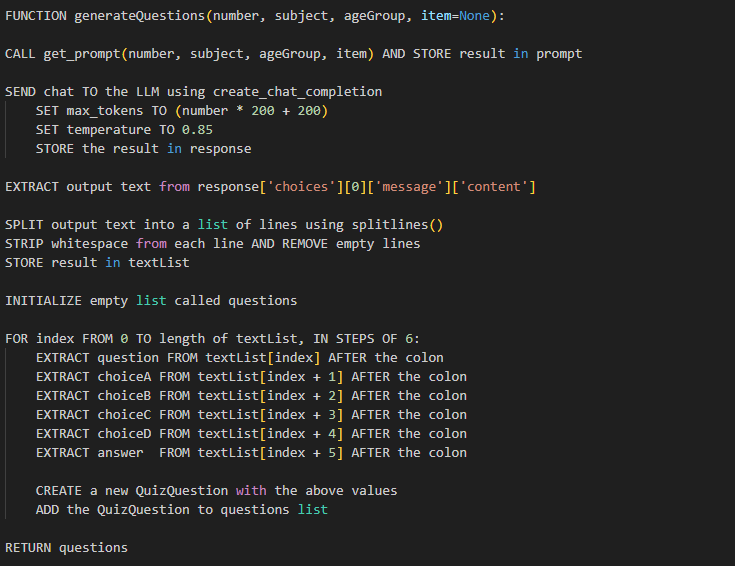
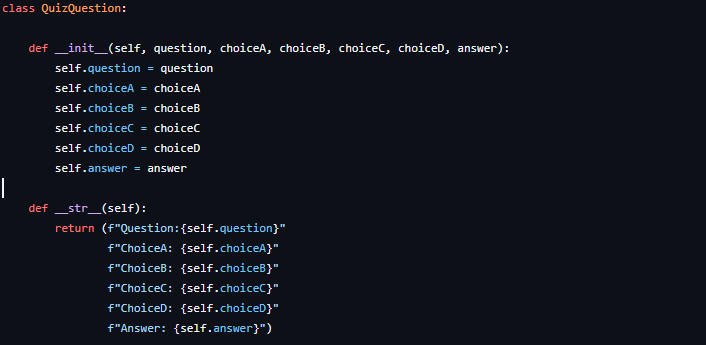
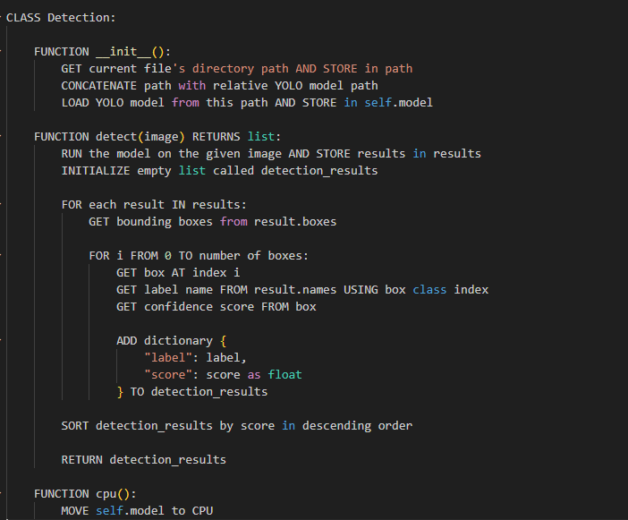
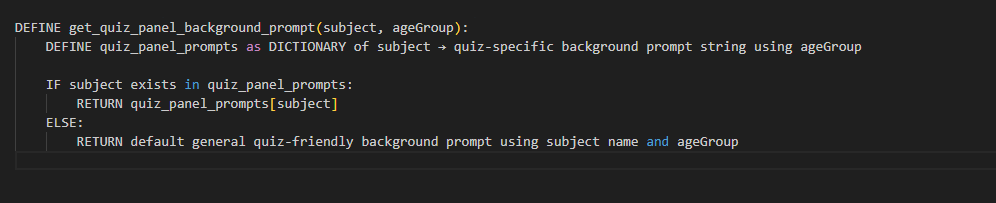
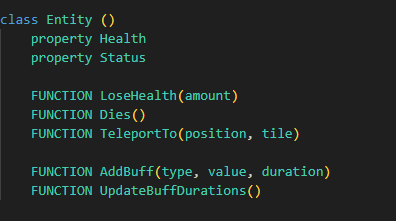
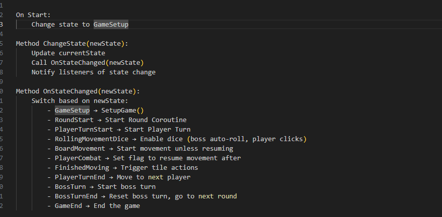
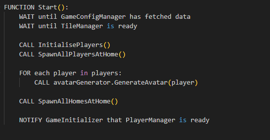
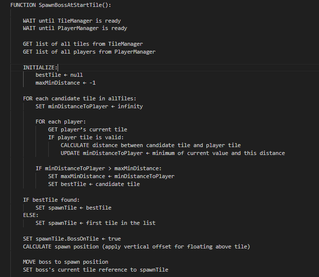

## Overview

Our project aims to reduce the burden of generating lesson materials for teachers as well as create an entertaining environment where students can both learn and enjoy themselves by playing a game with their cohort. The use case of our project and its target audience has been constantly kept in mind during the development process; hence we have made several design choices to make our project as accessible and easy to use for our target audience as possible. This is achieved by using quantized AI models, optimized rendering pipelines and a lightweight networking solution.

## Technologies

<details>
<summary>Unity (URP)</summary>

We use Unity's Universal Render Pipeline (URP) to ensure optimal performance on mobile devices while maintaining visual clarity. All assets are low-poly to reduce rendering cost.
</details>

<details>
<summary>Photon PUN 2</summary>

For multiplayer capabilities, Photon's PUN 2 library enables real-time syncing of players over a remote cloud server, we have been selective on which components need further reliability handshakes and delta compression to reduce network overhead as much as possible without impacting the performance of our game too greatly.
</details>

<details>
<summary>IBM Granite 3 8B (Quantized to 4-bit)</summary>

The AI backend uses a lightweight quantized model of IBM's Granite 3-8B Instruct LLM for generating multiple-choice quiz questions tailored to different subjects and age groups the quantized optimization allows for question generation to work on devices with 4GB of VRam.
</details>

<details>
<summary>DreamShaper 8 (Stable Diffusion Model)</summary>

This diffusion model is used to generate themed backgrounds for quizzes. It supports both decorative and minimalistic quiz panel modes.
</details>

<details>
<summary>YOLOv11x (OpenCV)</summary>

Real-time object detection is powered by YOLOv11x. It's used to analyze classroom images and identify objects relevant to quiz generation or interaction.
</details>

<details>
<summary>React + Vite (Dashboard Frontend)</summary>

The teacher-facing dashboard is built with React and bundled using Vite, it provides a user-friendly interface for teachers to set up quizzes.
</details>

## Teacher Dashboard Implementation

### 1.1 IBM Granite Question Generator

The Quiz sequence is an essential component in our game, as mentioned earlier quiz generation happens via our LLM, to allow teachers to set up the game we have created a Teacher Dashboard where there are options to input subject, number of questions, age group and an optional parameter of item for our object recognition feature. These inputs are then used to construct a well-structured prompt for the LLM and that output is parsed and grouped, the teachers can view the questions immediately after generation and can confirm which questions they want in the game.

#### Parameter Collection and Request Initiation

When the teacher configures the quiz using the dashboard form, a GET request is made to the backend API using the specified parameters, this api call is `GET /ai/generate/`.

This API call requests the question set generated by our LLM based on the inputs the teacher has selected.

#### Prompt Construction 

Once the request is received, a prompt is built based on the teacher's input, bellow is an accurate pseudocode representation of how this prompt set up is done in our project:



This prompt building allows us to receive a consistent format of answers from the LLM, it also allows us to not only generate question sets by simply subject and age group but also by using the object recognition feature. As you can see in the pseudocode, when there is an item provided, the prompt rescopes to form questions around said item.

#### Generating Questions

To generate questions, we call the prompt builder function we have just described, parse the generated prompt and pass it into the LLM. We then need to process and clean the output of the LLM, this is used to display the question sets in the teacher UI and the game quiz sequence. 



The pseudocode above illustrates how this is achieved in our implementation. Specifically, we extract the relevant content from Granite’s output, then split the response into individual lines. These lines are filtered to retain only those that contain questions, answer options, or correct answers. Since our prompt enforces a consistent and sequential format, we are able to group these elements accordingly to construct structured quiz questions. Each quiz question is generated as follows:



#### Confirming and Displaying Questions in the Dashboard

Once the questions are generated and parsed, they are displayed in the Teacher Dashboard interface for review. The teacher can view each question along with its multiple-choice options and correct answer. At this stage, the teacher has the option to confirm the generated questions before they are used in the game.

When the teacher confirms the selected questions, a POST request is sent to the backend via the following API route:

`POST /config/confirm-questions/`
This route receives the final list of questions chosen by the teacher and stores them in the backend configuration.

To retrieve and display the confirmed questions in the Teacher Dashboard or in-game logic, we use:

`GET /config/get-questions/`
This endpoint fetches the saved list of questions from the backend, ensuring that both the frontend dashboard and the Unity game client can access a consistent set of confirmed quiz data.

### 1.2 Object Recognition

As mentioned earlier, our system incorporates an object recognition feature that allows teachers to hold up an object, and the backend uses a YOLOv11x model to identify the objects in the image. These detected objects can then be used to guide the quiz generation process, as outlined in the prompt construction section.

Object recognition is triggered via the following route:

`POST /recognize/`
This endpoint receives an uploaded image and analyzes it using the YOLOv11x object detection model.

After receiving the request, the backend runs inference using the YOLOv11x model. The image is passed into the model, which returns a list of bounding boxes, class labels, and confidence scores. The highest confidence results are then sorted and returned to the front end.

This process is shown in the pseudocode snippet below, which outlines how the detection class loads the model, performs inference, extracts object labels and scores, and returns the final sorted list of recognized items:



These labels are then optionally used during prompt generation to produce questions specific to the recognized item, enabling question sets with the recognised object. 

### 1.3 Background Generation

Our system also generates background images using the stable diffusion model Dreamshaper 8, this is used for the background image of the quiz panel and the game board panel, these backgrounds correlate to the theme of the question sets for the game. 

For background generation we have two API Routes:

`GET /generate-background-image/`

`GET /generate-quiz-background-image/` 

The prompts passed to the model are generated using helper functions based on the subject and age group selected by the teacher. The logic is illustrated below:




This pseudocode shows how the prompt is selected. If a predefined subject prompt exists, it is used; otherwise, a general fallback prompt is constructed. This approach ensures that we always return a prompt compatible with our diffusion model, even for subjects not explicitly defined.

Once generated, the backgrounds are displayed on the Teacher Dashboard for review. The teacher can then confirm their preferred images, which are uploaded to the backend using `POST /confirm-background/` for decorative backgrounds and `POST /confirm-quiz-background/` for quiz panel backgrounds, ensuring they are available for use in the final game environment.


## Game Implementation

### 3.1 Core entity classes

Our game contains two types of entities, Players and Boss. The player entity is what each student controls, boss is an environment entity that the player competes again. Both entities inherit from the Entity Class, a concise pseudo code version of this can be seen below: 

 

As you can see from the above, the entity class defines some important base stats such as health and status, status reffers to wether an entity is alive or not, as the game progresses players battle the boss entity and these core stats are essential to the logic for this, the methods `LoseHealth` and ` Dies` is how we implement changes in the health and status. 

The pseudocode also illustrates the set up for the buff system, throughout the game players can recieve buffs that provide some sort of advantage, below we will go into further depth about the types of buffs. The Entity method `UpdateBuffDuration` and `AddBuffs` are used to add buffs and manage how long they last. 

#### Player Class and Boss Class

As we have discussed alerady player and boss both inherit the Entity class, however they both also have individual stats and behaviour that is not shared between the two, below is a summary of the key individual components. 

<details>
<summary>Player</summary>

Contains unique properties and functionality including:
- Player Identification:
  - Unique playerID
  - Points, Level tracking
  - Trophy and Quiz Streak counters

- Health System:
  - Revival counter
  - Maximum health settings
  - Health management methods (damage, healing, revival)

- Buff Management:
  - PlayerBuffs container (extends EntityBuffs)
  - Special buff handling (DoublePoints, etc.)

- Core Functions:
  - Awake & Update: Initializes state and UI elements
  - UI Initialization: Updates based on game mode (COOP/FFA)
  - Points & Trophy Management: Handles leveling, buffs, rewards
  - Teleportation: Board position management with height offsets

- State Management:
  - Turn indicators (directional cone)
  - Death state handling
  - Level progression logic
</details>

<details>
<summary>Boss</summary>

Contains unique properties and functionality including:
- Core Structure:
  - Singleton pattern implementation
  - Dynamic MAX_HEALTH scaling
  - Entity class inheritance

- Health System:
  - Health scaling based on player count
  - Death condition triggers game win
  - Health UI synchronization

- Buff Management:
  - BossBuffs container (extends EntityBuffs)
  - Restricted buff application logic
  - Boss-specific buff validation

- Core Functions:
  - Initialization: Sets up health and initial state
  - Damage Handling: Updates health and UI
  - Teleportation: Board position management
  - Test Buff Application: Development testing

- State Management:
  - Death state handling
  - Win condition triggering
  - Position tracking
</details>


### 3.2 Pre-game character selection 

The flow diagram above describes the overall game flow for our project, we will discuss this flow in more detail in later section of this report, however we have also included a pregame stage for additional customisation of player avatars. 
This Character selection stage allows for customisation of the color of the player avatar and what hat the player avatar wears, this is stored and is later accessed by our player manager to initalise player avatars with the correct presets. 

#### Character Selection 

```pseudo
Start:
    Get all body color options under player
    Get all hat options under player
    Turn all off
    Turn on first body color and hat

NextBodyColor / PreviousBodyColor:
    Turn off current body color
    Change index (forward/backward, wrap around)
    Turn on new body color

NextHat / PreviousHat:
    Turn off current hat
    Change index (forward/backward, wrap around)
    Turn on new hat

StartGame:
    Save selected body color and hat
    Load game scene
```

The simplified pseudocode above illustrates the core logic behind this selection

### 3.3 Manager Overview


The flow diagram above illustrates the core game flow for our project, this is flow is controlled by `GameManager` which utilises sevral other submanagers that control the flow of key aspects of the game such, the `GameManager` manages states in a centralised way, below is an illustration the different states in `GameManager` and the flow from each state .





As mentioned our game contains several sub managers along with the GameManager that is the central authority on state flow. Below is a high level view of all the managers in the game and their respective tasks:

<details>
<summary>PlayerManager</summary>

- Handles player initialization and spawning
- Manages player appearances and customization
- Controls turn progression between players
- Updates player stats and UI elements
- Handles trophy and level progression
</details>

<details>
<summary>BossManager</summary>

- Controls boss spawning and initialization
- Manages boss positioning on the board
- Handles boss movement and combat triggers
- Updates boss health and state
</details>

<details>
<summary>UIManager</summary>

- Manages all in-game UI elements
- Handles prompts and notifications
- Updates player stats displays
- Controls button interactions and animations
</details>

<details>
<summary>CameraManager</summary>

- Controls camera positioning and movement
- Manages zoom levels and transitions
- Handles combat view transitions
- Positions dice for rolling
</details>

<details>
<summary>CombatManager</summary>

- Orchestrates combat sequences
- Manages attack and defense phases
- Calculates damage and applies effects
- Controls combat animations and transitions
</details>

<details>
<summary>RoundManager</summary>

- Tracks game rounds and turns
- Handles round-based point allocation
- Manages player revival system
- Updates buff durations
</details>

<details>
<summary>TileManager</summary>

- Manages board tile interactions
- Controls path highlighting
- Handles special tile effects
- Manages tile connections and navigation
</details>

<details>
<summary>QuizManager</summary>

- Loads and manages quiz questions
- Controls quiz flow and timing
- Evaluates player performance
- Handles reward distribution
</details>

<details>
<summary>DiceManager</summary>

- Controls dice rolling mechanics
- Manages multiple dice instances
- Calculates roll results
- Handles physics-based dice simulation
</details>

### 3.4 Game Setup

At the start of our game after character selection we load up `ARBoard Scene` and enter the state `GameSetup` when this state starts in game manager the method. This method essentially calls our game initaliser which checks if all core components are initalised. 


The above shows a simplified version of our swtich case to illustrate which managers are checked at game setup, they only enter this swtich case when the manager object is loaded and the intialisation steps for each indiivdual manager is complete.

### 3.5 Player and Boss Initalisation

As mentioned in section 3.1 our game contains two entities, boss and player, initalisation for the player happens through player manager, the snippet below is a simplified view into how this happens: 



As you can see tile manager needs to be initalise before player initalisation and tile spawn, this because players spawn in at home tiles and tiles keep track of wether there is a player on them, so it is essential to allow for players to spawn. 

Spawn for boss happens in a similar fashion but instead of spawning at home tiles, boss spawns in relation to a given distance between players. 



### 3.6 Board Generation

### 3.7 Tiles

In our game the board is made up of several tile components, there are several types of tile componenets which trigger different actions for players that land on them, 
the different type of tile components is outlined below: 
 - Home Tile : if a player lands on this type of tile their turn simply finishes there are no tile actions. 
 - Quiz Tile : this tile allows the player that landed on the quiz tile to enter the quiz sequence.
 - Re-Roll Dice Tile : the player gets an extra dice roll before their turn ends
 - Trap Tile : the player takes some damage reducing their health 
 - Gain Points Tile : the player gains a specified amount of points
 - Lose Ponts Tile : the player loses a specified amount of points
 - Portal Tile : the player teleports to another portal tile, this happens at random. 


### 3.8 Movement

Player movement is a core mechanic in the game. At the start of their turn, players roll a set of dice to determine how many steps they can move across the board. This mechanic is orchestrated by the DiceManager and Dice classes and tightly with the board, animation, and prompt systems.

#### Dice Rolling Logic
When the player's turn begins, the DiceManager enables the roll button. The number of dice is calculated based on player buffs (e.g., ExtraDiceBonus). Once the player rolls:

Old dice are cleared and new ones are instantiated.Each dice object (Dice) is thrown with physics-based forces and torque. Dice monitor their stability until they land and determine the result.
#### `Role Dice Logic` 
```pseudo
FUNCTION EnableDiceRoll(isBoss):
    IF isBoss:
        SET numDice = 1 + boss bonus
    ELSE:
        SET numDice = 1 + player bonus
    SHOW roll dice button

FUNCTION RollDice():
    CLEAR old dice
    INSTANTIATE numDice new dice
    FOR each dice:
        ADD force and torque based on world scale
        SUBSCRIBE to OnDiceFinishedRolling

FUNCTION HandleDiceFinishedRolling():
    Decrement remainingDice
    IF all dice rolled:
        RETURN total sum to GameManager
```
The Dice class handles individual dice physics. It detects when a dice becomes stable or times out after 5 seconds and determines the face pointing upward as the result.

#### Movement Execution
Once the dice roll is complete, the result is passed to the PlayerMovement class, which moves the player across tiles step by step. Each step decrements the remaining movement count.
#### `MovePlayer` 
```psuedo 
FUNCTION MovePlayer(steps):
    WHILE steps > 0:
        IF crossroads:
            PROMPT player for direction
        MOVE to next tile
        steps -= 1
        WAIT for animation
```

We have a hop movement animation for each tile and camera tracking ensures the player stays in view. Prompts are presented via PromptManager, and player decisions are passed back using callbacks.

Boss Movement happens in a simmilar fashion however as no one plays as the boss, the dice are automatically rolled, all direction choices are made optimally so the boss will always move towards the closest player, this works with a Breadth First Search algorithim, how this is implemented is shown below:

#### `GetDirectionTowardsPlayers` 
``` psuedo
FUNCTION GetDirectionTowardsPlayers(startTile, availableDirections):
    nextTile, currentTile = null, startTile
    initialDirections is empty dictionary
    queue is empty queue 
    visited is empty set

    FOR each direction IN availableDirections:
        SET nextTile TO startTile.GetConnectedTile(direction)
        IF nextTile is not null:
            ADD nextTile TO queue
            SET initialDirections[nextTile] TO direction

    WHILE queue is not empty:
        SET currentTile TO queue.Dequeue()

        IF currentTile in visited:
            CONTINUE

        ADD currentTile TO visited

        IF currentTile has players:
            RETURN initialDirections[currentTile]

        FOR each direction IN currentTile.GetAvailableDirections():
            nextTile = currentTile.GetConnectedTile(direction)
            IF nextTile is not null AND nextTile not in visited:
                ADD nextTile TO queue
                IF nextTile not in initialDirections:
                    SET initialDirections[nextTile] TO initialDirections[currentTile]

    RETURN random direction from availableDirections
    ```

As show above, the algorithim maintains an intial dictionary of directions, and maps each explored tile to its corresponding inital direction, if a player is found after moving down this direction the intial direction is returned. We make use of a queue for this traversal, this ensures that the algorithim checks all tile directions a step at a time naturally choosing the closest option. If no player is found the boss does not have an optimal choice to make and hence a fall back of any random valid direction is choosen.


### 3.9 Combat

### 3.10 UI 


## Multiplayer Implementation 


