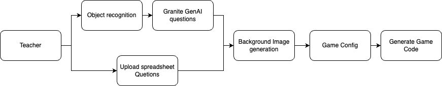
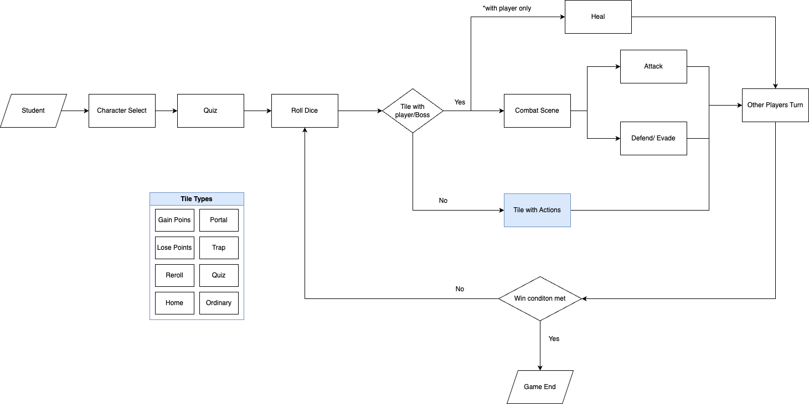

# Requirements

## Section 1 - Project Overview

### Section 1.1 - Project Background

Classroom Explorers is a mixed reality board game designed to support students with Special Educational Needs and Disabilities (SEND). Many SEND students struggle to focus in class and require more detailed, interactive learning experiences. Traditional teaching methods may not always meet their needs, which is where our game provides an innovative solution.

In partnership with IBM, we used IBM Granite GenAI and the DreamShaper image generator to create tailored content, helping teachers streamline lesson preparation. We use the Unity game engine to develop most of the game, including the integration of mixed reality to allow students to interact with 3D models. This makes learning more engaging while ensuring they remain aware of their real-world environment rather than being overly absorbed in digital screens.

Classroom Explorers also enhances accessibility by enabling remote learners, such as hospitalized children, to participate in lessons just like their peers. Our online features ensure hybrid learners can collaborate and engage in the same interactive experience. Additionally, the game is free, providing an inclusive and widely accessible educational resource for students and teachers alike.

### Section 1.2 - Project Goals

#### Educational, Interactive, and Design

Classroom Explorers aims to provide an innovative and engaging learning experience for students with SEND needs across borders through a mixed reality board game. By integrating interactive gameplay, AI-generated content, and a well-structured teacher interface, our game seeks to support both students and educators. Our objectives align with three key pillars: Educational Value, Interactivity, and Design Quality.

#### Educational:
- Provide an innovative and meaningful learning experience tailored to SEND students and hybrid learners.
- Utilize lightweight AI-generated content to adapt to different lesson plans and student needs.
- Support teachers by streamlining lesson preparation with customizable game content.

#### Interactive:
- Incorporate mixed reality elements to engage students through 3D models and immersive gameplay.
- Ensure collaborative learning by allowing both in-class and remote students to interact seamlessly through different game modes.
- Encourage active participation rather than passive learning through game mechanics and quiz elements.

#### Design:
- Develop the game using the Unity engine for optimized performance across different devices.
- Use a mild color palette to create a visually comfortable and accessible experience for students, reducing sensory overload.
- Ensure the game logic is intuitive and easy to understand, allowing students to grasp the rules quickly without confusion.
- Maintain a well-structured teacher UI that simplifies navigation and lesson customization.

To ensure these objectives are met, we have gathered insights from teachers at the National Autistic Society (NAS) and conducted online research on best practices for designing interactive and accessible educational tools.

## Section 2 - Key Target Audiences

Our game target audience includes students with SEND needs and teachers, specifically schools from the National Autistic Society but not limited to them. We hope to meet all their needs and then further expand our project to accommodate other schools' use cases. To get user feedback, we conducted a school visit to Helen Allison School, a school under NAS, to showcase and test our game with students and teachers who will be using our game as class materials. We gained many useful insights and understandings regarding interactivity and game design.

### Section 2.1 - Teachers
- **User-friendly design**
- **Customizable**
- **Efficient**
- **Appropriate content**
- **Low spec device compatibility**

### Section 2.2 - Students with SEND Needs
- **Fun**
- **Educational**
- **Interactive**
- **Rewarding**
- **Calming theme**

### Section 2.3 - Remote Students
- **Low latency**
- **Feels like within the same classroom**
- **Equal learning opportunity and quality**

After meeting all the requirements with NAS, we aim to further develop our game to be class material not only for students with SEND needs but also for any student around the world.

## Section 3 - Use Case Diagrams

### Section 3.1 - Teachers

### Section 3.2 - Students

## Section 4 - MoSCoW Requirements List

| Requirement Description | Priority | State |
|-------------------------|----------|-------|
| The application should run natively in Unity and be cross-platform for mobiles, tablets, and laptops. | MUST | DONE |
| Make use of various AI models, all offline and embedded for use on devices. | MUST | DONE |
| Using YOLO for Object Detection. | MUST | DONE |
| The board game can host up to 6 players. | MUST | DONE |
| Buzz question mode. | MUST | DONE |
| The board needs to be AR placed on a table. | MUST | DONE |
| Topic is presented to Granite to generate the questions on the topic, with a level of user indication (age group). | MUST | DONE |
| Allow questions upload. | MUST | DONE |
| At least 6 tile types for the board game. | MUST | DONE |
| Teacher Dashboard Website for game setup. | MUST | DONE |
| A Q&A sequence in-game to prompt players to answer questions. | MUST | DONE |
| GenAI should be used to set the background image of the board. | SHOULD | DONE |
| CO-OP Mode for players to work together instead of compete. | SHOULD | DONE |
| Combat System which uses dice rolls. | SHOULD | DONE |
| Customizable avatar with different colors and cosmetics. | SHOULD | DONE |
| Allow remote play online. | SHOULD | DONE |
| Game board is generated at runtime, customizable with JSON. | SHOULD | DONE |
| Objects (such as toys and small figures) are to be image recognized using offline AI with Granite. They would then be the avatars of the player in their virtual round of the game. | SHOULD | NO |
| Generate 3D meshes for the background. | COULD | NO |
| Geography (linking questions to Google Earth opening), science (including scientific animations), and maths (with explainers in the center of the board). | WON’T DO | |

