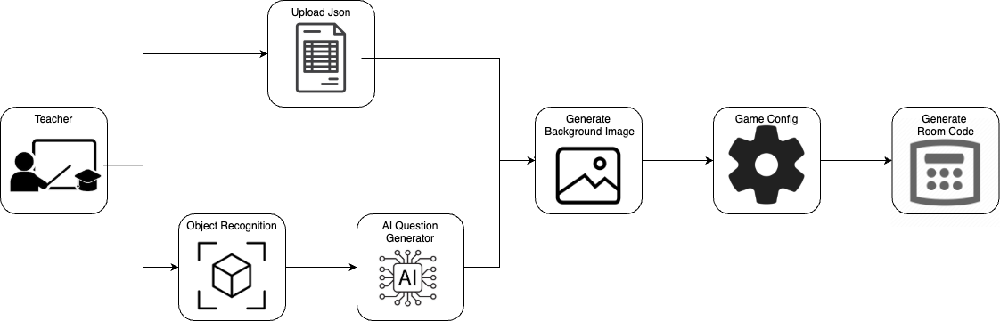

## Section 1 - Project Bacground and Overview

Classroom Explorers is a mixed reality board game designed to support students with Special Educational Needs and Disabilities (SEND). Many SEND students struggle to focus in class and require more detailed, interactive learning experiences. Traditional teaching methods may not always meet their needs, which is where our game provides an innovative solution.

In partnership with IBM, we used IBM Granite GenAI and the DreamShaper image generator to create tailored content, helping teachers streamline lesson preparation. We use Unity game engine to develop the majority of the game, including integration of mixed reality to allow students to interact with 3D models, making learning more engaging while ensuring they remain aware of their real-world environment rather than being overly absorbed in digital screens.

Classroom Explorers also enhances accessibility by enabling remote learners, such as hospitalized children, to participate in lessons just like their peers. Our online features ensure hybrid learners can collaborate and engage in the same interactive experience. Providing an inclusive and widely accessible educational resource for students and teachers.

---

## Section 2 - Project Goals

Our project goal is to create a mixed reality board game app using unity engine, Object Recognition, Image Generation, and GenAI technology, specifically designed for students with SEND needs. The App should be able to run natively on Android platform with a wide range of compatibility. Also, there should be a teacher interface where teachers can easily set up the configuration for the game. 

Below are the major goals we have to complete:

- Mixed Reality Board Game built within Unity Engine with a range of game modes and game components.
- Web based Teacher Dashboard for class material preparation and game configuration.
- AI-Powered Backend which integrates Object Recognition, the IBM Granite model, and an Image Generation model, serving as a bridge between student and teacher applications.
- All AI and object recognition model are lightweight, Locally Run and compiled into an executable, ensuring efficient offline operation.

Our goal is to deliver a fully functional game with room for future expansion, allowing students to benefit from GenAI-driven learning. The solution will be designed with minimal technical dependencies and setup requirements, making it practical for school environments.

---

import Tabs from '@theme/Tabs';
import TabItem from '@theme/TabItem';

## Section 3 - Gathering Requirements
To better understand the needs of students with SEND (Special Educational Needs and Disabilities), we conducted interviews with teachers from the National Autistic Society. Due to security and safeguarding concerns, teachers answered on behalf of students through roleplay-based responses. We designed a survey with open-ended questions, analyzed the responses, and refined our initial requirements accordingly.

<Tabs>
  <TabItem value="teacher" label="Teacher" default>
    <b>Question:</b> What should the level of difficulty be for the games?
    
<b>Answer:</b> Some children have significant learning difficulties, so It would be helpful to have simple levels that can scale in terms of difficulties based on age group and other requirements. The AR object-based game shouldn't be super complex for higher needs students.

    
    <b>Question:</b> How can we make it engaging for the children?
    
<b>Answer:</b> Suggestions: first to reach target goal in team trivia game mode ; star-based reward system ; controlling the virtual board with physical movement.

    
    <b>Question:</b> How can the game be more accessible for the children?
    
<b>Answer:</b> Pair questions with visual cues to aid children who aren't fully literate yet ; Make sure the overall audio and visuals are not overwhelming but still engaging.

    
    <b>Question:</b> In what scenario will the game be used in a class?
    
<b>Answer:</b> It will be used in class after finishing teaching every topic, to help consolidate students' learning.

  </TabItem>
  
  <TabItem value="student" label="Student with SEND needs">
    <b>Question:</b> What kind of games do you like to play?
    
<b>Answer:</b> I love playing games where I can win points or stars when I do well in them

    
    <b>Question:</b> Would you like a game where you could play together with friends as a team?
    
<b>Answer:</b> I think playing with my friends is really fun, but I think playing against them might be good sometimes too, so I want to be able to choose.

    
    <b>Question:</b> How do you feel about games where you have to answer questions or solve puzzles?
    
<b>Answer:</b> I like when the questions are not too hard. It's fun if I can get a hint if I don't know the answer right away.

    
    <b>Question:</b> What obstacles have you faced in the traditional way of learning?
    
<b>Answer:</b> Traditional learning lack interactivity and I often lost my interest in learning directly from books, but I love learning new things.

  </TabItem>
</Tabs>

---

## Section 4 - Personas

Below are the Personas we have created for both Teachers and Students using the answers from the interviews.

### Section 4.1 - Teachers from NAS

**Jack Simmon** is a dedicated teacher for primary school students with special educational needs (SEN). His primary goal is to create engaging, educational experiences that are informative, fun, and accessible to all students. He emphasizes that students with **Special Educational Needs and Disabilities (SEND)** benefit greatly from:

#### User Requirements for Teachers:
1. **Interactive & Engaging**: Use quizzes, games, and interactive tools to maintain attention.
2. **Accessible to Lower Literacy Levels**: Provide simplified text and audio options for support.
3. **Tailored Learning**: Content should be customizable for different age groups and learning abilities.
4. **Calming Theme**: Use soft, non-distracting colors and minimalistic design to reduce sensory overload.
5. **Mixed Reality**: Utilize visual incentives like 3D avatars or virtual environments for immersion.
6. **Remote Access**: Ensure seamless video call and remote interaction capabilities for accessibility.

### Section 4.2 - Students with SEND Needs

**Eric Stevens** is a 10-year-old child with **Special Educational Needs and Disabilities (SEND)**, particularly facing challenges with attention and focus during school tasks. However, he loves playing games with his peers, which helps maintain his engagement. He desires a learning experience that feels more like play and offers constant feedback to help guide his learning progress.

#### User Requirements for Eric:
1. **Self-Paced Learning**: Control over learning speed with options to pause, rewind, or slow down.
2. **Peer Interaction**: Competitive or collaborative elements to stay engaged with classmates.
3. **Colourful Visuals**: Bright, appealing graphics that stimulate attention without overwhelming.
4. **Frequent Feedback**: Immediate positive reinforcement to encourage progress.
5. **Game Engagement**: Points, avatars, and rewards to maintain interest.
6. **Clear Instructions**: Simple guidance for easy navigation and understanding.

---

## Section 5 - Use Case Diagrams

### Section 5.1 - Teachers
This diagram shows how teachers can use the Teacher Dashboard to set up the game for students. It is a three step process: i) Question Preparation, ii) Generate Background Image, iii) Game Configuration. Then the game environment will be set up.

### Section 5.2 - Students
This diagram shows how the students can interact within the game, it shows the order of action they can take. Students will be joining a round based board game with Quiz elements, and combat events. The game will iterate until the winning condition is met.

---

## Section 6 - MoSCoW Requirements List

| Requirement Description                                                                                                                                                             | Priority  |
|-------------------------------------------------------------------------------------------------------------------------------------------------------------------------------------|---------|
| The application should run natively in Unity and be cross-platform for mobiles, tablets, and laptops.                                                                               | MUST     | DONE  |
| Make use of various AI models, all offline and embedded for use on devices.                                                                                                         | MUST     | DONE  |
| Using YOLO for Object Detection.                                                                                                                                                    | MUST     | DONE  |
| The board game can host up to 6 players.                                                                                                                                            | MUST     | DONE  |
| Buzz question mode.                                                                                                                                                                 | MUST     | DONE  |
| The board needs to be AR placed on a table.                                                                                                                                         | MUST     | DONE  |
| Topic is presented to Granite to generate the questions on the topic, with a level of user indication (age group).                                                                  | MUST     | DONE  |
| Allow questions upload.                                                                                                                                                             | MUST     | DONE  |
| At least 6 tile types for the board game.                                                                                                                                           | MUST     | DONE  |
| Teacher Dashboard Website for game setup.                                                                                                                                           | MUST     | DONE  |
| A Q&A sequence in-game to prompt players to answer questions.                                                                                                                       | MUST     | DONE  |
| GenAI should be used to set the background image of the board.                                                                                                                      | SHOULD   | DONE  |
| CO-OP Mode for players to work together instead of compete.                                                                                                                         | SHOULD   | DONE  |
| Combat System which uses dice rolls.                                                                                                                                                | SHOULD   | DONE  |
| Customizable avatar with different colors and cosmetics.                                                                                                                            | SHOULD   | DONE  |
| Allow remote play online.                                                                                                                                                           | SHOULD   | DONE  |
| Game board is generated at runtime, customizable with JSON.                                                                                                                         | SHOULD   | DONE  |
| Objects (such as toys and small figures) are to be image recognized using offline AI with Granite. They would then be the avatars of the player in their virtual round of the game. | SHOULD   | NO    |
| Generate 3D meshes for the background.                                                                                                                                              | COULD    | NO    |
| Geography (linking questions to Google Earth opening), science (including scientific animations), and maths (with explainers in the center of the board).                           | WON’T DO |       |

