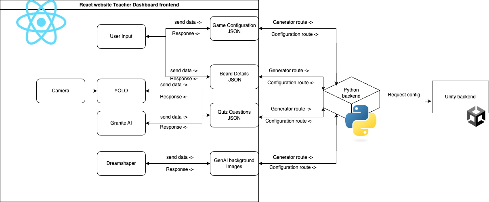

# System Architecture

## Overview
Our system is designed to facilitate interactive learning by connecting a web-based Teacher Dashboard with a Student Board Game through a centralized backend server. The architecture enables real-time data exchange, ensuring a seamless user experience for both teachers and students. The following diagram provides a high-level view of our system design.

The **Teacher Dashboard** is a web application built using React with Vite, allowing teachers to configure game settings, upload quiz questions, and customize the game environment. It communicates with the backend server via RESTful API calls to generate content such as quiz questions and background images, retrieve stored configurations, and send object recognition requests for image analysis. The dashboard enables teachers to interact with the system efficiently, ensuring that their inputs are reflected in the student-facing application.

The **Student Board Game** is an interactive application developed in Unity. It dynamically loads game configurations and retrieves quiz data, background images, and game settings from the backend to ensure synchronization with the teacher’s input. The backend provides these configurations, dictating how the game is structured based on teacher-defined parameters. Since Unity is responsible for both the game’s frontend and backend logic, it directly interacts with the central server to fetch data and update the gameplay accordingly.

---

## Section 1 - Teacher Dashboard and Backend

The **Backend Server** acts as the core communication bridge between the Teacher Dashboard and the Student Board Game. Built with Python, it handles API requests related to AI-based content generation, object detection, and configuration management. The server is divided into two key API route categories:
- **Generator Routes (/ai)**: Manage AI-powered features such as object recognition (YOLO), quiz question generation (Granite), and background image creation (DreamShaper).
- **Configuration Routes (/config)**: Store and retrieve game settings, ensuring consistency across both the teacher and student interfaces.

### Section 1.1 - AI-Powered Content Generation
One of the primary features of the system is AI-powered content generation:
- **Object Recognition**: Implemented using YOLO, it allows the game to analyze and respond to visual inputs.
- **Quiz Generation**: AI-generated quiz questions are created based on predefined parameters, enabling personalized learning experiences.
- **Background Images**: Backgrounds and quiz panel images are dynamically generated using DreamShaper, allowing for customization based on different themes.

This architecture integrates AI-driven functionality with a data exchange system. The combination of web and game-based interfaces, supported by a robust backend, ensures that teachers can easily manage content while students receive an adaptive and immersive educational experience.

---

## Section 2 - Student Board Game

The **Student Board Game** is developed using the Unity Engine. It is a round-based game where students interact by pressing buttons to perform actions. The game logic is organized and managed through various components, ensuring seamless gameplay and a consistent user experience. Several game objects, including players and interactive elements, are controlled by dedicated managers to maintain the integrity of the game flow.

Below is a diagram of how key components interact to managing the game state, UI, and game logic:

.drawio.png)

### Section 2.1 - Key Components

- **Entity (Abstract Class)**: Serves as the foundational class for both players and bosses, encapsulating common properties such as health, status (alive/dead), and key behaviors like losing health, dying, teleporting, and managing buffs.
    - **Buff System**: Allows entities to receive temporary attribute modifications, such as attack boosts or special abilities (e.g., DoublePoints or ExtraDice), and tracks the duration of these buffs. 
    - **EntityBuffs**: Manages active buffs on entities, providing bonus stats like attack or defense and handling the lifecycle of buffs, including expiration and reset.
  
- **Board**: The main map for players to move around.
  - **Board Generation**: Dynamically creates the board layout from a JSON file, instantiating tiles and arrows, and setting up tile connections and scaling.
  - **Dice Simulation**: Simulates dice rolls using Unity physics, tracks stability, and determines the roll result.
  - **Tile Management**: Handles special tile actions, path highlighting, visual feedback, and manages interactions like teleporting, gaining points, and triggering quizzes.
  
- **Reward**: Defines reward tiers and buffs based on quiz performance.
  - **Random Reward Selection**: Randomly selects a reward from the appropriate tier.
  - **Buff Application & Notification**: Applies the selected buff to the player and triggers UI notifications.
  
- **Combat System**: Manages combat interactions, including handling health reduction and status changes.

- **Quiz System**: Handles quiz popups for players.
  - **Quiz Management**: Handles question loading, quiz flow, and performance evaluation, tracking user answers and calculating rewards.
  - **Quiz Flow Control**: Manages the quiz session, transitions between questions, and timing, including evaluating correct answers and streaks.
  - **UI Integration**: Coordinates with the UI to display quiz content, including questions, answers, and progress, and signals quiz completion.

- **Player Class**: Inherits from `Entity` and includes unique properties such as playerID, Points, Level, TrophyCount, QuizStreak, and a revival counter. It manages player-specific buffs via a `PlayerBuffs` container.
  - Key methods handle points and level progression, awarding permanent buffs and increasing maximum health as the player levels up, along with managing health, revival, and teleportation on the board.
  - The UI Initialization and Update methods ensure the player’s state and UI elements are updated dynamically based on the game mode (COOP or FFA), enhancing the user experience.

- **Boss Class**: Inherits from `Entity` and uses a singleton pattern to ensure only one boss instance exists, with `MAX_HEALTH` dynamically adjusted based on the number of players.
  - The `BossBuffs` container manages the boss’s buffs, with restrictions in place to prevent player-only buffs (e.g., DoublePoints). Buffs are added and updated through specific methods that check for valid types.
  - Key methods handle damage and death, update the UI upon health reduction, trigger win conditions when the boss dies, and teleport the boss to different board positions with height offsets.

- **AR Foundation Integration**: Utilizes Unity's AR Foundation, including components like `ARRaycastManager` for detecting surfaces via touch input and `ARPlaneManager` for tracking flat surfaces (e.g., floors, tables).
  - **Board Placement and Scaling**: The `ARBoardPlacement Script` adjusts the virtual board’s position, scaling, and rotation based on touch input, ensuring proper placement on detected surfaces with a world scale adjustment for realistic AR rendering.
  - **Finalization**: Once the board is placed, the script locks in the position, disables further surface detection, and proceeds with game setup, ensuring smooth transition into gameplay.

- **UI Manager**:
  - **UI Initialization and Setup**: Configures UI elements like stat displays, player prompts, and directional choices at the start of the game.
  - **Dynamic Updates**: Continuously updates UI components, including player stats, health, points, and turn indicators, ensuring real-time feedback during gameplay.
  - **User Prompts & Button Interactions**: Manages interactive prompts for decisions and handles button actions, such as dice rolls or combat choices, with smooth player input integration.

### Section 2.2 - Multiplayer Integration

A key feature that we wanted to include in our game was accessibility. This didn’t just mean accessibility for all
skill levels and ages but also to make the game available to students who are currently missing the school
experience due to any personal challenges or health issues. Due to this we wanted to incorporate a fully
remote version of our game, allowing students to take part with their classmates not just for educational
purposes but also for the social aspects of playing games with their peers.

**Design Choices**
- **Cloud-Based Services & Matchmaking:**  
  Photon PUN2 provides integrated cloud services that include matchmaking, room management, and
lobby systems. These features streamline the process of connecting players, reducing the overhead
typically associated with building these systems from scratch.
  
- **Centralised Architecture:**  
  Photon provides a robust client-server architecture with a master client that can do key authoritative
decisions such as game startup. This provides a simpler flow of logic and a robust centralised network
which minimises clients from being unsynchronised.

- **Advantages Over Other Networking Solutions:**
  While Unity has several strong contenders for networking, we found that other solutions such as Mirror
to not be suitable as it is mainly optimised for client–client architectures, which makes integrating a
cloud-based system more challenging

**Multiplayer Startup Flow**

- **Photon Custom Properties:**  
  After initalisation and a verified connection to the server, character appearance preferences,
as well as nickname and gameplay variables such as points and trophies are stored to each
client's custom properties. This allows them to be called later so every remote client can view
all other clients' preferences and progress throughout the game.

- **Lobby System:**  
  There is also an additional layer before game start up after character selection, we have
introduced a lobby scene where players wait for all other players to finish connecting and
choosing their avatar preferences. The master client can then load up the main game scene
when the lobby has 2-6 players, allowing all clients to start the game at the same time, this is
necessary to ensure state synchronisation of all clients from the very beginning.

- **Master Client Logic:**  
  The first client to join the lobby scene becomes the master client, they are the only client
allowed to start the main game scene, preventing multiple clients from beginning the game at
different times. The client remains the master client for the rest of the game unless there is a
disconnect, in which case the master client is automatically reassigned to the next available
client.

--- 

## Section 3 - System Flow

1. **Teacher UI Initialization**  
   The system starts with the Teacher UI, a React web application that allows teachers to configure and launch the game. The teacher logs into the dashboard, where they can manage game configurations, upload quiz questions, and customize the game environment.

2. **Quiz Question Generation**  
   The teacher can generate quiz questions through two methods:
   - **Method 1:** Uploading a JSON spreadsheet containing predefined quiz questions.
   - **Method 2:** Using AI-based object recognition, where images are processed with `detection.py` to detect objects. The detected objects are then converted into prompts for `questionGenerator.py`, which dynamically generates quiz questions.

3. **Themed Image Creation**  
   The teacher can create themed background images and quiz images using `dreamShaper.py`. By providing a text prompt, the system generates visuals that align with the desired theme. The teacher then configures various game settings such as age group, theme, difficulty level, and game mode.

4. **Game Launch**  
   The teacher starts the game by creating a unique room code, which students use to join. Students enter the room code on the Student Board Game, customize their characters in **Scene: CharacterSelect**, and enter **Scene: BoardScene**. Players roll dice to move across the board, answer quiz questions, and collect points. The game progresses until a winner is determined based on accumulated points.

---

## Section 4 - Design Pattern
Here is a list of Design Patterns that we have used to develop our game:

| **Design Pattern**       | **Usage**                                  | **Purpose**                                                                                      |
|--------------------------|--------------------------------------------|--------------------------------------------------------------------------------------------------|
| **Singleton Pattern**     | Game managers (Player manager, Boss manager, round manager, etc.) | Persistent objects across scenes and manage game objects across different scripts.               |
| **Object Pooling**        | Player class, Boss class, Board Generator class | Reduce instantiation overhead by reusing objects instead of constantly creating and destroying them. |
| **State Pattern**         | UI manager, Quiz manager                   | Allows UI elements to set active and inactive states based on game logic; provoke quiz state when condition met. |
| **Observer Pattern**      | Player class, UI manager                   | Allows multiple objects (observers) to react to events from another game object without tight coupling; follow an event-driven system. |
| **MVC Pattern**           | Model (Player, Boss, Tile, etc.), View (UI manager), Controller (Player manager, Boss manager, Tile manager, etc.), Teacher UI | Separates game logic (Model), UI (View), and input handling (Controller) to keep code organized and allow room for agile development. Teacher UI: separate frontend and backend via REST API, following MVC pattern. |
| **Factory Pattern**       | Teacher UI (Question generator, Image generator) | Generator to create useful resources for the system.                                             |
| **Repository Pattern** | Backend API calls | Manages API calls in the backend|
