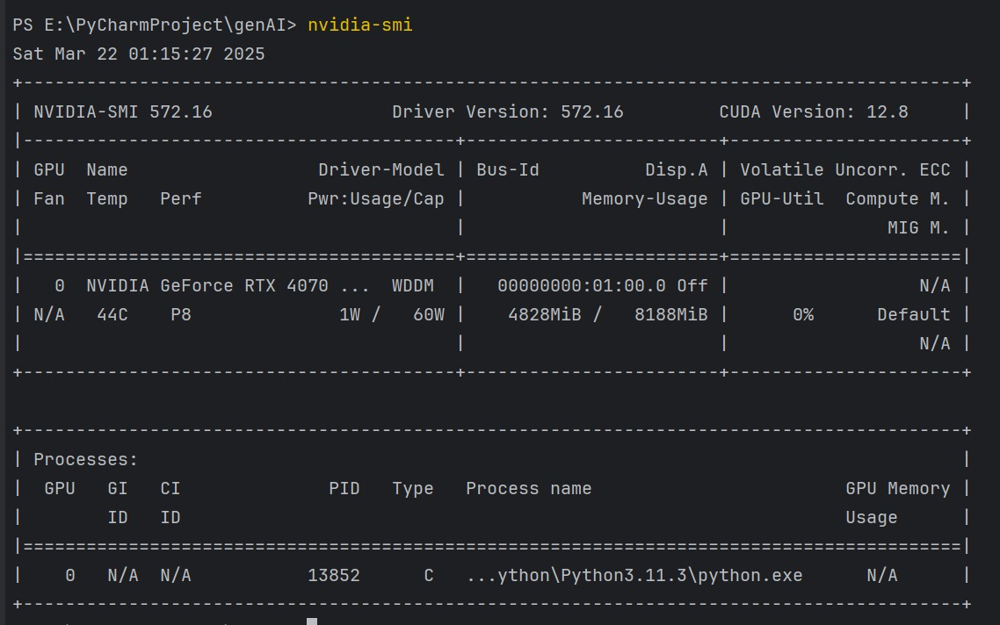

# Testing

## Overview
We have undertaken a comprehensive testing approach to ensure our project meets the majority of the requirements while gathering sufficient user feedback to improve our product. Continuous testing was conducted throughout the project, allowing us to make iterative changes to the game. This ensured that we addressed all user needs, considering both design aspects and hardware compatibility across various use cases.

Below are the key testing methods we employed:

#### Unit Testing
- Implemented unit testing for Educational Question Generator API.

#### Performance Testing
- Evaluated performance for the Educational Question Generator API.

#### Compatibility Testing
- Tested the game on various devices with different hardware specifications to ensure broad accessibility.

#### User Acceptance Testing
- Conducted real-world testing with various user groups, including:
  - Helen Allison School (NAS) visit
  - AI for Good showcase to clients
  - School outreach visits

---

## Section 1 - Unit Testing

We employed a combination of unit and integration testing to validate the core functionality of our Educational Question Generator API. Given the nature of our system, which is primarily backend-focused and does not rely on Android-specific components, we used standard Python testing libraries. The key tools leveraged were `pytest`, Starlette's `TestClient`, and `coverage.py`.

The tests aim to ensure that each API endpoint behaves correctly under various scenarios. We simulate user interactions with our HTTP endpoints and assert that the expected business logic is applied consistently.

### Section 1.1 - Purpose of API Testing

API tests are a critical part of our backend validation. These tests ensure the correctness, robustness, and reliability of the API endpoints, which are responsible for generating educational quiz questions based on user-provided parameters such as subject, age group, and topic.

API tests offer confidence that:
- Valid requests return the appropriate HTTP 200 status and structured responses.
- The question generation logic returns meaningful and parameter-compliant questions.
- The system handles edge cases and invalid input gracefully by returning proper error codes like 400 or 404.

### Section 1.2 - Testing Frameworks

Our API tests are written using `pytest` for test orchestration and Starlette's `TestClient` for simulating HTTP requests. We use pytest fixtures to set up a shared client across test modules, simplifying the codebase and ensuring consistency in test environments.

The following tools were used:
- **pytest**: Main testing framework for writing and running test cases.
- **TestClient**: Simulates HTTP requests against the FastAPI application.
- **coverage.py**: Measures code coverage across the API test suite.

A simplified version of the `conftest.py` fixture is shown below:

```python
# conftest.py
import pytest
from starlette.testclient import TestClient
from app.main import app

@pytest.fixture(scope='module')
def client():
    with TestClient(app) as c:
        yield c
```

### Section 1.3 - Example Test

The following test ensures that the `/ai/generate/` endpoint returns a valid question based on user input:

**api/test_generate_questions.py**

```python
def test_generate_questions(client):
    params = {
        "number": 1,
        "subject": "History",
        "ageGroup": "10-12",
        "item": "French Revolution"
    }
    response = client.get("/ai/generate/", params=params)
    assert response.status_code == 200
    
    data = response.json()
    assert data.get("message") == "success"
    assert "questions" in data.get("data")
    assert len(data["data"]["questions"]) == 1
```

### Section 1.4 - Testing Approach

- **Unit Testing**: Focused on the correctness of individual API endpoints, ensuring proper request handling and response formats.
- **Integration Testing**: Verifies how the API integrates with internal components, such as the question generation logic and any external services.
- **Negative Testing**: Tests the system's resilience by providing malformed or incomplete input to validate proper error responses.

### Section 1.5 - Code Coverage
Our team prioritizes maintaining a high level of test coverage. Using coverage.py, we achieved over 90% code coverage across the backend. To ensure this standard is met, we run:
```
coverage run --source=app -m pytest
coverage report --show-missing
coverage html --title "${@-coverage}"
```
Maintaining this threshold helps ensure that core functionality, including edge cases, is thoroughly validated and production-ready.

--- 

## Section 2 - Performance testing
We tested the performance of the Educational Question Generator application to ensure it runs efficiently under various conditions, particularly focusing on CPU usage, memory usage, and response times. The goal was to identify any potential bottlenecks and gain a deeper understanding of the application's overall efficiency.

The tests were conducted on a server that aligns with the expected production environment, equipped with a multi-core processor, 16GB of RAM, and GPU support for model loading. We simulated real-world usage by performing the tests over extended periods and under varying load conditions, including both normal and high-concurrency scenarios. To measure the performance, we used **Apifox** to simulate concurrent API requests and measure response times. Additionally, we used **psutil** for monitoring CPU and RAM usage and **nvidia**-smi to track GPU VRAM usage during model loading and question generation.



The results were promising. For **response time**, the application consistently handled requests with an average time of under 10 seconds for generating a standard quiz question, even under high-concurrency conditions. The maximum response time was recorded to be below 15 seconds, which is well within the acceptable range for real-time interactions. This demonstrates that the application is responsive and capable of handling multiple simultaneous requests without significant delays.

In terms of **memory usage**, the application performed efficiently with stable memory consumption throughout the tests. The system’s GPU VRAM and RAM usage were continuously monitored, and we observed no significant spikes during model loading or question generation. The total VRAM usage remained within a stable range of 2GB, while the system’s RAM usage remained below 8GB, even during stress tests. This suggests that the single model loading strategy is highly effective in managing memory usage and avoiding excessive resource consumption.

For **stability**, we conducted long-duration stress tests by simulating increased concurrent requests over a 60-minute period. During this time, the application continued to perform well, with no noticeable memory leaks or gradual slowdowns. The error rate remained below 1%, indicating that the system could handle sustained usage without any major issues.
One of the key considerations during our testing was the **model loading strategy**, which ensures that only one model is loaded at a time. This prevents the system from being overwhelmed by multiple large models, ensuring that memory is used efficiently and reducing the risk of out-of-memory (OOM) errors. As a result, the system's memory usage remained well-controlled throughout the tests, and the application performed stably even under peak loads.
In **conclusion**, the tests confirmed that the application performs efficiently across a range of scenarios. The system was able to handle high-concurrency conditions with minimal resource consumption, and the overall performance remained stable even during extended usage. Although hardware differences (e.g., GPU and CPU capabilities) may affect performance slightly, the application should remain responsive and functional across a wide variety of devices, making it suitable for production deployment.

---

## Section 3 - Compatibility Testing

We have tested our game on multiple devices across different platforms, including Android smartphones, tablets, iPads, Windows laptops, and Macs. Below is a list of devices and their specs. We have tried devices with low specs to ensure that our game can run smoothly, considering a classroom scenario with limited processing power and RAM.

### Device Model and Specs

| Device Model               | Specs                       |
|----------------------------|-----------------------------|
| **MacBook Pro (2021) M1 Pro** | CPU: M1 Pro, RAM: 16GB      |
| **Samsung Galaxy S20 FE**   | CPU: Snapdragon 870, RAM: 8GB |

With our extensive compatibility testing, we are confident that our game will have no issue running on the devices provided in a classroom setting.

---

## Section 4 - User Acceptance Testing

The tests were conducted at the Helen Allison School (NAS) within the Hub, targeting students primarily aged 14 to 17. The purpose of the evaluation was to validate the effectiveness of our product for students with diverse needs. Specifically, we assessed whether:

- The game’s mechanics can be easily understood in a single play session
- Students demonstrate investment in the game and engage actively in answering questions
- The game is appropriate for a learning environment

Over the course of 30-minute sessions across three classes, we presented our CO-OP game mode and teacher dashboard using a single device, with gameplay projected for both students and teachers. Participants actively posed questions and engaged in collaborative discussions regarding the project. 

Additionally, some classes, already familiar with games reminiscent of *Classroom Explorers* such as *Mario Party*, recognized similarities without explicit guidance. Nonetheless, all classes clearly understood the objectives of the game and participated actively in the quiz segments.

### Section 4.1 - Test Feedback

The feedback was mainly positive, with many expressing that the concept was interesting. However, many were concerned with the time length of the game. Below are the feedback we have collected:

#### Game Feedback (CO-OP Mode)

|Feedback|
----------------------------------------|
| Liked the visuals                                                         |                                        |
| Concept quite good and creative                                           |                                        |
| Good selection of Outcomes (Tiles)                                        |                                        |
| It’s easy to play (controls)                                              |                                        |
| It was really colorful                                                    |                                        |
| Takes a lot of time to understand, symbols need explaining, etc.          |                                        |
| It’s educational                                                          |                                        |
| Liked that you can either play against each other (FFA) or part of the team (CO-OP) |                                |
| Liked the idea of students being able to join remotely                    |                                        |
| Maybe the game should show which questions were correct/wrong after the players answered |                          |
| It is ideal if the game finishes quicker, around 25 minutes. Can be done by making the map/board smaller |               |
|it’s not clear what’s going on sometimes, there should be a zoom function|

#### Teacher Dashboard Feedback

| Feedback                                                                 |
----------------------------------------|
| Great that it has different levels/difficulties for questions             |                                        |
| It would be great if there were inclusion of more subjects like maths     |                                        |
| The AI-generated questions are good                                        |                                        |
| The questions take quite a bit of time to generate                        |                                        |

### Section 4.2 - Conclusion

The user evaluation yielded predominantly positive feedback alongside a small number of constructive criticisms that have directly informed our development roadmap. In response, we have implemented and planned the following enhancements:

- **Optimized game duration:** Leveraged the JSON Board Generator to produce a smaller map and reduced the number of quiz sections per round, streamlining gameplay without sacrificing learning objectives.


- **Improved usability:** Added a zoom function to the desktop version in response to user requests, acknowledging that this feature is not applicable within the AR environment.


- **Ensured content accuracy:** Identified Granite’s automatic question‑generation limitations and are pursuing alternative methods to deliver reliable and correct quiz content.


Overall, participants reported high satisfaction with both the board game experience and the teacher dashboard. Should the project proceed to further development, we will keep in mind the importance of refining content accuracy, enhancing the user interface, and optimizing session length to maximize engagement and educational effectiveness.
