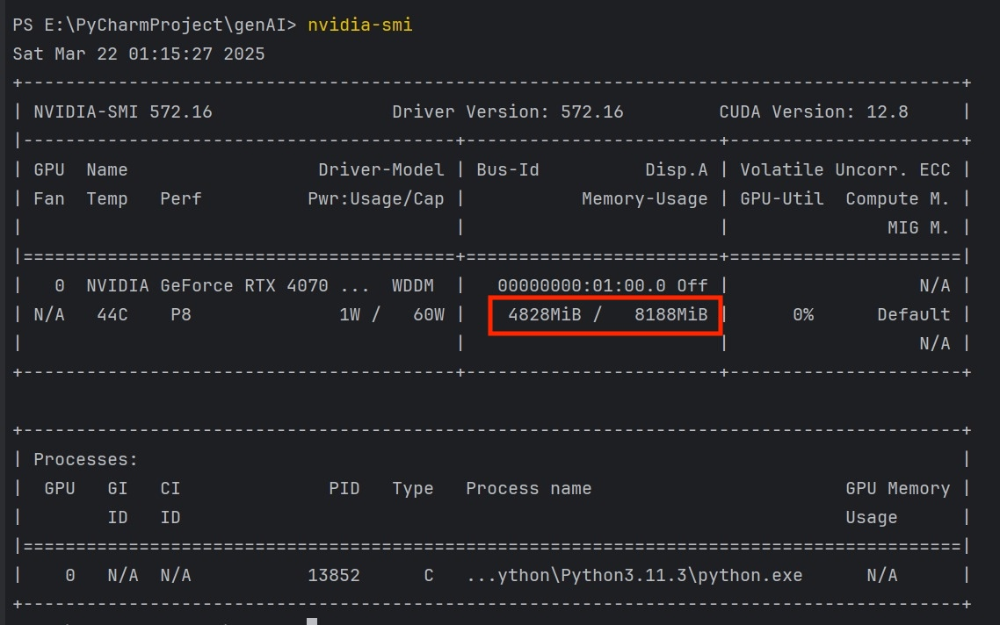

## 🧪 Overview

The test suite focuses on ensuring the reliability and correctness of the **Educational Question Generator**
application's core functionalities. The tests are structured primarily in two key areas:

1. **API Tests (`/api/` folder)**
2. **Configuration and Fixtures (`conftest.py`)**

---

## 📂 Test Structure Breakdown

### 1. **`api/` Folder**

Contains unit and integration tests targeting the API endpoints of the application.

- **Purpose:**  
  To verify that API endpoints respond correctly to valid and invalid requests, and that generated quiz questions meet
  expected formats and logic.
    - **Test Coverage:**
        - **Question Generation Validity:**
            - Test that generated questions conform to the input parameters.
            - **API Response Status Codes:**
                - Checks for HTTP 200 success codes and appropriate error handling (e.g., 400 Bad Request, 404 Not
                  Found).
            - **Edge Case Handling:**
                - Ensures robustness when input parameters are missing or malformed.
            - **Data Consistency:**
                - Verifies if repeated calls with identical inputs yield consistent question formats.
- **Example:**

```python
      # --- Test the question generation endpoint ---
        def test_generate_questions(client: TestClient):
            """
            Test the /ai/generate/ the question generator.
            """
            # Prepare query parameters matching GenerateModel fields.
            params = {
            "number": 1,
            "subject": "History",
            "ageGroup": "10-12",
            "item": "French Revolution"
            }
            response = client.get(f"{settings.BASE_URL}/ai/generate/", params=params)
            assert response.status_code == 200
                
            resp_json = response.json()
            logging.info(f"Generate questions response: {resp_json}")
            assert resp_json.get("message") == "success"
                
            data = resp_json.get("data")
            assert data is not None
            assert "questions" in data
            assert len(data["questions"]) == 1
```

---

### 2. **`__init__.py`**

Standard file to mark the directory as a Python package. No test logic here, but necessary for test discovery.

---

### 3. **`conftest.py`**

- **Purpose:**  
  Provides shared fixtures and configurations for the test suite.

- **Features:**
    - **Fixture Setup:**
        - Sets up test clients and test environment configurations.
    - **Reusable Components:**
        - Simplifies test case writing by reusing pre-defined clients and data.

```python
from typing import Generator

import pytest
from starlette.testclient import TestClient

from app.main import app


@pytest.fixture(scope='module')
def client() -> Generator:
    with TestClient(app) as c:
        yield c
```

---

## ✅ Test Execution

- **Framework Used:**  
  Likely `pytest` based on standard Python testing practices.

- **Test Strategy:**
    - **Unit Testing:**  
      Focused on individual API endpoint correctness.
    - **Integration Testing:**  
      Ensuring the components interact correctly (e.g., database calls, question generation logic).
    - **Negative Testing:**  
      Validates how the system handles incorrect inputs and exceptions.
- **Coverage Requirement:**
    - We ensure that the code coverage consistently exceeds 90%. To check coverage, we use the following commands:
      ```bash
      coverage run --source=app -m pytest
      coverage report --show-missing
      coverage html --title "${@-coverage}"
      ```
      The tests are only considered passing if coverage is maintained above 90%.

---

## 📊 Performance Tests

### **Purpose:**

To ensure that the application performs efficiently under various workloads, particularly focusing on response time,
memory usage, and stability during peak usage scenarios.

### **Key Considerations:**

- **Model Loading Strategy:**
    - Our backend is specifically designed to **load only one model at a time**, which avoids the simultaneous loading
      of multiple large models that could otherwise consume excessive GPU/CPU memory (VRAM/RAM).
    - This approach guarantees controlled memory usage and prevents system crashes due to out-of-memory (OOM) errors.

### **Performance Metrics:**

1. **Response Time:**
    - Measure the average and maximum response times for key endpoints, especially `/ai/generate/`, under both normal
      and high-concurrency conditions.
2. **Memory Usage:**
    - Monitor system memory and GPU VRAM before, during, and after model loading to ensure that memory is released
      appropriately after processing requests.
3. **Stability:**
    - Run long-duration stress tests to detect any memory leaks or gradual slowdowns.

### **Tools and Techniques:**

- **Apifox** for simulating concurrent API requests and measuring performance.
- **Memory Profiling Tools** such as:
    - `psutil` (for CPU/RAM usage monitoring)
    - `nvidia-smi` (for GPU VRAM monitoring)
- **Logging and Monitoring:**
    - Leverage detailed logging of model loading/unloading times and system resource usage.

---

### **Performance Benchmark Goal:**

- **Response Time:**  
  Maintain average response time **under 10s** for per standard quiz question ✅

- **Memory Usage:**  
  Ensure VRAM and RAM usage remain stable, thanks to the **single model loading strategy**, even under peak loads. ✅



- **Error Rate:**  
  Keep error rates (e.g., timeouts, OOM errors) **below 1%** during stress tests. ✅

---

## 🚀 Conclusion

The current test suite lays a solid foundation for verifying API functionality, with good modularization via
`conftest.py` and logical structuring of API tests. Expanding test cases and incorporating automated reporting tools
would further strengthen code reliability and maintainability.
