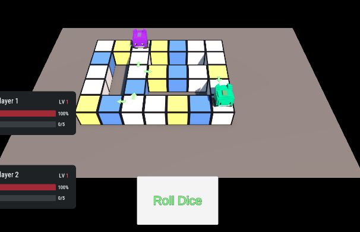
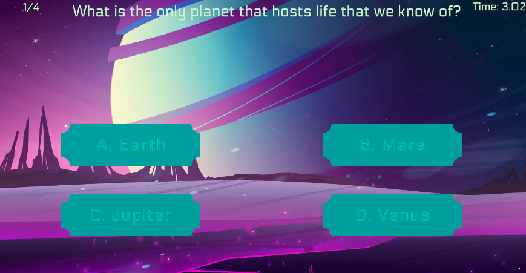
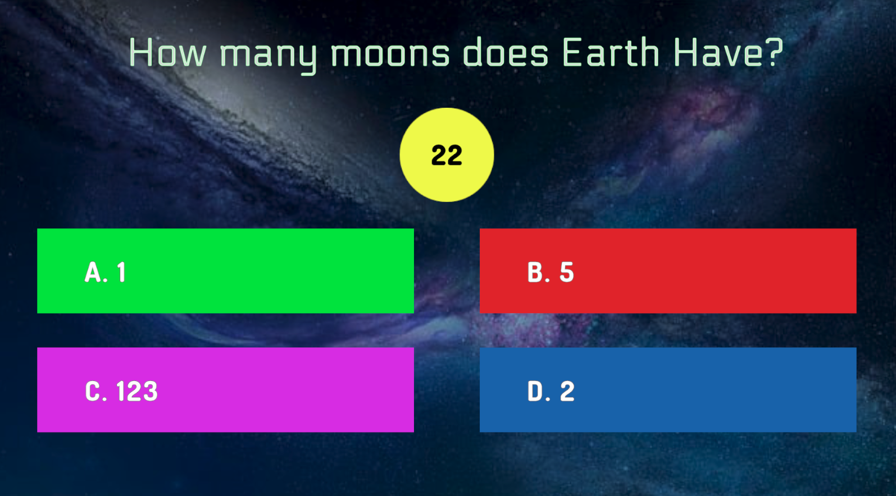
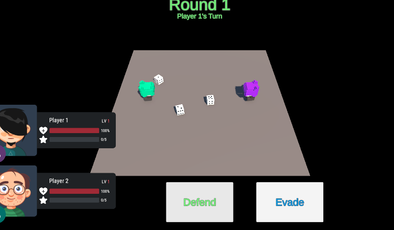
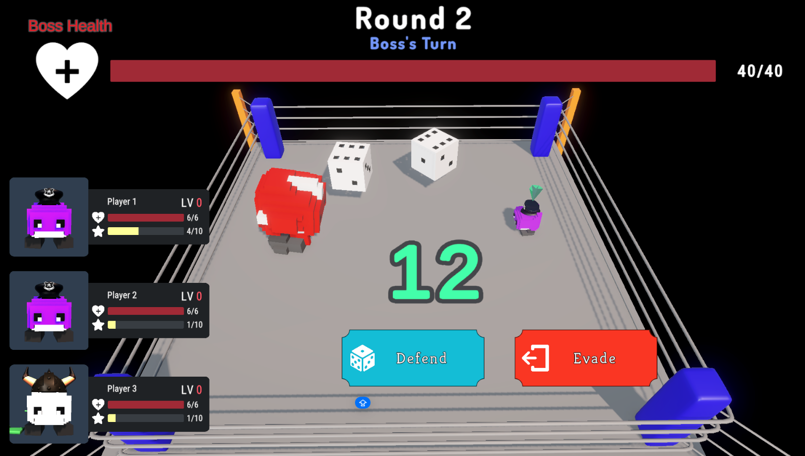
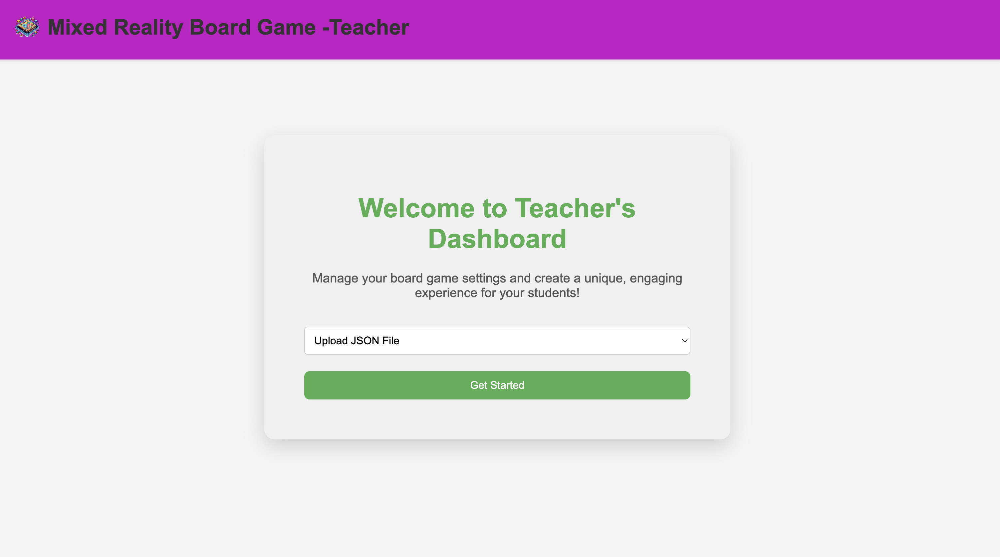

# UI Design

## Section 1 - Design Principles
> Simple, Engaging, and Inclusive

### Simple
Our game is intuitive and easy to pick up, requiring minimal effort to understand. The game logic is straightforward—users only have two primary actions: answering a quiz or rolling a dice. Both actions are performed by pressing clearly marked buttons, ensuring accessibility and ease of use for all players.

### Engaging
To enhance motivation and participation, we implemented a scoring system. Students can earn points by engaging with the game, which can be exchanged for trophies or used to compete with their peers, adding a fun and competitive element to the learning process.

### Inclusive
The game is designed to be adaptable for students across various age groups and learning abilities. It also supports remote play, allowing students from different locations, including those learning from home or abroad, to participate seamlessly alongside their peers in school.

---
## Section 2 - Prototypes and Final Designs

The user interface is a crucial part of our project, and we have continuously improved it throughout development by actively seeking and incorporating feedback from both teachers and students. By adopting an iterative, user-centered design approach, we refined the interface to ensure it is accessible, engaging, and functional.

For the **Game app**, we prioritized simplicity and clarity in the game app to ensure a smooth experience, especially for students with SEND (Special Educational Needs and Disabilities). The app’s main components include: board layout, quiz popup, and combat scene.

To streamline development, we incorporated assets from the UltimateCleanUI pack from the Unity Asset Store, which provided us with professionally designed UI elements such as buttons and fonts, saving us time while maintaining a polished aesthetic.

To reduce complexity, the interface relies primarily on button interactions to minimize the learning curve. Additionally, based on feedback from NAS (National Autistic Society) teachers, we adopted a mild color palette to create a comfortable and inclusive visual environment.

For the **Teacher Dashboard**, simplicity and functionality were the primary goals. The dashboard is designed to streamline teachers’ workflow by providing them with an intuitive interface for managing and monitoring the game effectively.

### Section 2.1 - Board layout

We initially created a board with basic buttons and tiles, but early user testing highlighted several issues. Users found it difficult to understand what the tiles represented, and the lack of directional cues made navigation unclear. Additionally, the large board made it hard to track which player was currently moving. Over time, we have evolved the board design significantly based on constant user feedback.

**Improvements based on feedback:**
- **Camera Tracking:** A camera now follows the current moving player to ensure users can easily see the gameplay.
- **Tile Highlighting:** Tiles are highlighted based on dice rolls to indicate available paths clearly.
- **Animations:** Smooth animations for movement, scoring, and actions were added to enhance engagement.
- **Tile Textures:** Different textures were introduced to make tile actions easily recognizable.
- **UI Enhancements:** Using the UltimateCleanUI pack, we upgraded buttons and fonts for a more polished, professional look.

  

    **Initial Design:**
    
  

  

    **Final Design after continuous improvement:**
    
  

### Section 2.2 - Quiz pop up

With the feedback during the school visit, we found out our initial quiz pop-up design had shortcomings, including unappealing button and font choices and a timer with decimals, which students found intimidating.

**Improvements:**
- A clearer and more calming timer was introduced.
- The visual appeal was enhanced through better font choices and more inviting text box colors, based on teacher feedback.

  

    **Initial Design:** 
    
  

  

    **New Design after suggestions from teachers:**
    
  

### Section 2.3 - Combat Scene

The original combat scene lacked animations and had unclear combat logic. Feedback from both students and teachers highlighted that the lack of animations and unclear dice mechanics detracted from the experience.

**Improvements:**
- **Combat Animations:** We added animations for attack and defense actions.
- **Dice Roll Results:** The dice result now remains visible on the screen, helping players understand combat outcomes.
- **Visual Overhaul:** The environment was redesigned to resemble a combat arena, enhancing immersion.

  

    **Initial Combat Scene:**
    
  

  

    **Improved Combat Scene:**
    
  

### Section 2.4 - Teacher Dashboard

In our initial dashboard, page descriptions were vague and did not clearly explain their functionality. During demos with teachers from NAS during “AI for Good Showcase”, several questions arose about the meaning of different pages, highlighting this issue.

**Improvements:**
- We revised page descriptions to use clearer and more descriptive wording, reducing confusion and ensuring teachers could navigate the dashboard with ease.

  

    **Initial Teacher Dashboard:**
    
  

  

    **Improved Teacher Dashboard:**
    
  

